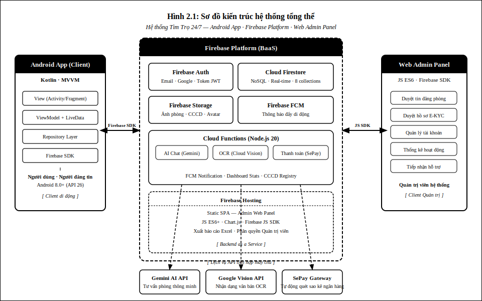
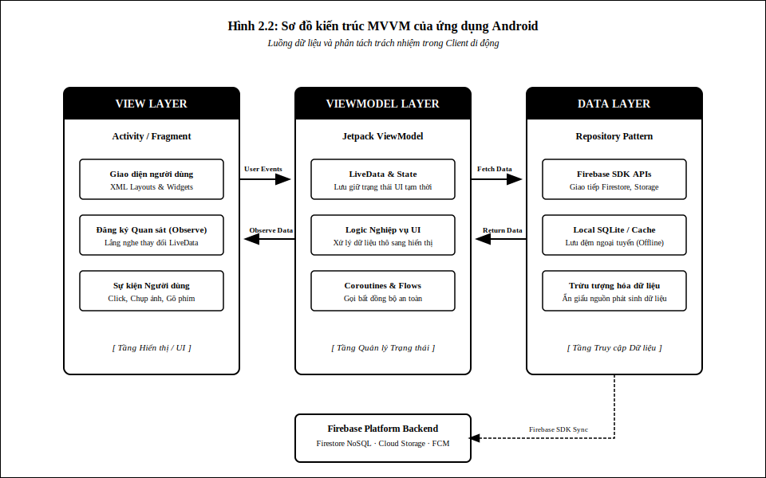
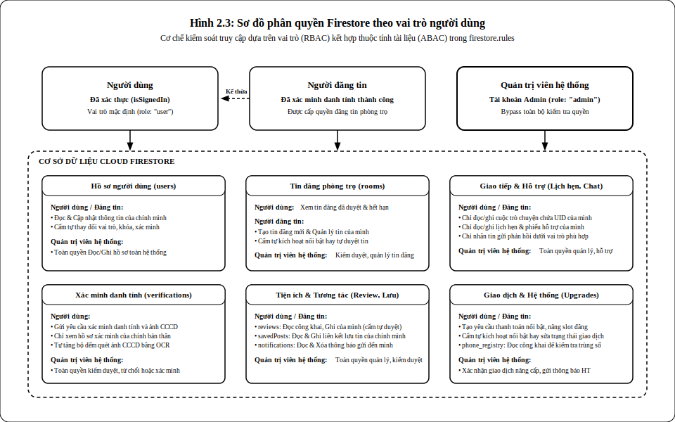
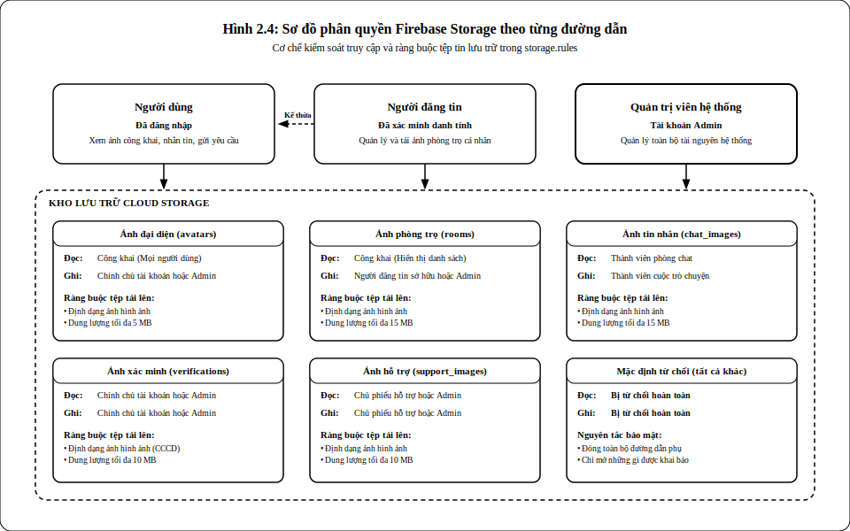

# TRƯỜNG ĐẠI HỌC THỦY LỢI
## KHOA CÔNG NGHỆ THÔNG TIN

---

# PHÁT TRIỂN ỨNG DỤNG TÌM KIẾM VÀ ĐẶT LỊCH XEM PHÒNG TRỌ

**Sinh viên thực hiện:** Phạm Tiến Đạt  
**Mã sinh viên:** [MSSV]  
**Lớp:** [Lớp]  
**Ngành:** Công nghệ Thông tin  
**Giáo viên hướng dẫn:** [Tên giáo viên hướng dẫn]  

**HÀ NỘI, NĂM 2025**

---

## MỤC LỤC

- [DANH MỤC TỪ VIẾT TẮT](#danh-mục-từ-viết-tắt)
- [DANH MỤC HÌNH ẢNH](#danh-mục-hình-ảnh)
- [DANH MỤC BẢNG BIỂU](#danh-mục-bảng-biểu)
- [MỞ ĐẦU](#mở-đầu)
  - [Lý do chọn đề tài](#lý-do-chọn-đề-tài)
  - [Mục tiêu đề tài](#mục-tiêu-đề-tài)
  - [Đối tượng và phạm vi nghiên cứu](#đối-tượng-và-phạm-vi-nghiên-cứu)
  - [Phương pháp nghiên cứu](#phương-pháp-nghiên-cứu)
  - [Cấu trúc báo cáo](#cấu-trúc-báo-cáo)
- [CHƯƠNG 1: KHẢO SÁT VÀ PHÂN TÍCH ỨNG DỤNG TÌM KIẾM VÀ ĐẶT LỊCH XEM PHÒNG TRỌ](#chương-1)
  - [1.1 Bài toán tìm kiếm và đặt lịch xem phòng trọ](#11-bài-toán)
  - [1.2 Giải pháp công nghệ phát triển](#12-giải-pháp-công-nghệ)
  - [1.3 Mô hình hóa chức năng ứng dụng](#13-mô-hình-hóa-chức-năng)
  - [1.4 Mô hình dữ liệu ứng dụng](#14-mô-hình-dữ-liệu)
- [CHƯƠNG 2: THIẾT KẾ ỨNG DỤNG TÌM KIẾM VÀ ĐẶT LỊCH XEM PHÒNG TRỌ](#chương-2)
  - [2.1 Kiến trúc hệ thống](#21-kiến-trúc-hệ-thống)
  - [2.2 Cơ sở dữ liệu và Phân quyền](#22-cơ-sở-dữ-liệu-và-phân-quyền)
    - [2.2.1 Mô hình dữ liệu Firestore](#221-mô-hình-dữ-liệu-firestore)
    - [2.2.2 Phân quyền Firestore](#222-phân-quyền-firestore)
    - [2.2.3 Phân quyền lưu trữ tập tin](#223-phân-quyền-lưu-trữ-tập-tin)
  - [2.3 Thiết kế giao diện](#23-thiết-kế-giao-diện)
- [CHƯƠNG 3: TRIỂN KHAI ỨNG DỤNG TÌM KIẾM VÀ ĐẶT LỊCH XEM PHÒNG TRỌ](#chương-3)
  - [3.1 Triển khai ứng dụng](#31-triển-khai-ứng-dụng)
  - [3.2 Một số kết quả của ứng dụng](#32-kết-quả)
- [KẾT LUẬN VÀ HƯỚNG PHÁT TRIỂN](#kết-luận)
- [TÀI LIỆU THAM KHẢO](#tài-liệu-tham-khảo)

---

## DANH MỤC TỪ VIẾT TẮT

| Từ viết tắt | Giải nghĩa |
|---|---|
| API | Application Programming Interface — Giao diện lập trình ứng dụng |
| BaaS | Backend as a Service — Dịch vụ backend đám mây |
| CCCD | Căn cước công dân |
| CNTT | Công nghệ thông tin |
| DB | Database — Cơ sở dữ liệu |
| FCM | Firebase Cloud Messaging — Dịch vụ thông báo đẩy của Firebase |
| GCP | Google Cloud Platform — Nền tảng đám mây của Google |
| GPS | Global Positioning System — Hệ thống định vị toàn cầu |
| HTTP | Hypertext Transfer Protocol — Giao thức truyền tải siêu văn bản |
| IDE | Integrated Development Environment — Môi trường phát triển tích hợp |
| JSON | JavaScript Object Notation — Định dạng trao đổi dữ liệu |
| LLM | Large Language Model — Mô hình ngôn ngữ lớn |
| MVVM | Model-View-ViewModel — Kiến trúc phát triển phần mềm |
| NoSQL | Not Only SQL — Cơ sở dữ liệu phi quan hệ |
| OCR | Optical Character Recognition — Nhận dạng ký tự quang học |
| SDK | Software Development Kit — Bộ công cụ phát triển phần mềm |
| UI | User Interface — Giao diện người dùng |
| UID | User Identifier — Mã định danh người dùng |
| URL | Uniform Resource Locator — Địa chỉ tài nguyên thống nhất |
| UX | User Experience — Trải nghiệm người dùng |
| VNĐ | Việt Nam Đồng — Đơn vị tiền tệ Việt Nam |

---

## DANH MỤC HÌNH ẢNH

| Số hiệu | Tên hình | Trang |
|---|---|---|
| Hình 1.1 | Biểu đồ Use case tổng quát hệ thống | |
| Hình 1.2 | Biểu đồ Use case phân rã tác nhân Người dùng | |
| Hình 1.3 | Biểu đồ Use case phân rã tác nhân Người đăng tin (đã xác minh) | |
| Hình 1.4 | Biểu đồ Use case phân rã tác nhân Quản trị viên | |
| Hình 1.5 | Biểu đồ Use case Quản lý tài khoản | |
| Hình 1.6 | Biểu đồ hoạt động Đăng ký tài khoản | |
| Hình 1.7 | Biểu đồ tuần tự Đăng ký tài khoản | |
| Hình 1.8 | Biểu đồ Use case Tìm kiếm và xem phòng trọ | |
| Hình 1.9 | Biểu đồ hoạt động Tìm kiếm phòng trọ | |
| Hình 1.10 | Biểu đồ tuần tự Xem chi tiết phòng trọ | |
| Hình 1.11 | Biểu đồ Use case Đăng và quản lý tin phòng trọ | |
| Hình 1.12 | Biểu đồ hoạt động Đăng tin phòng trọ | |
| Hình 1.13 | Biểu đồ tuần tự Đăng tin phòng trọ | |
| Hình 1.14 | Biểu đồ Use case Đặt lịch xem phòng | |
| Hình 1.15 | Biểu đồ hoạt động Đặt lịch hẹn xem phòng | |
| Hình 1.16 | Biểu đồ tuần tự Đặt lịch hẹn xem phòng | |
| Hình 1.17 | Biểu đồ Use case Nhắn tin | |
| Hình 1.18 | Biểu đồ hoạt động Nhắn tin | |
| Hình 1.19 | Biểu đồ tuần tự Gửi tin nhắn | |
| Hình 1.20 | Biểu đồ Use case Xác minh danh tính CCCD | |
| Hình 1.21 | Biểu đồ hoạt động Xác minh danh tính CCCD | |
| Hình 1.22 | Biểu đồ tuần tự Xác minh danh tính CCCD | |
| Hình 1.26 | Sơ đồ mô hình dữ liệu tổng quan của ứng dụng | |
| Hình 2.1 | Sơ đồ kiến trúc hệ thống tổng thể | |
| Hình 2.2 | Sơ đồ tổ chức collection và subcollection trong Firestore | |
| Hình 2.3 | Sơ đồ phân quyền truy cập Firestore theo vai trò | |
| Hình 2.4 | Sơ đồ luồng xác minh danh tính và phân quyền Storage | |
| Hình 2.5 | Wireframe màn hình Trang chủ | |
| Hình 2.6 | Wireframe màn hình Tìm kiếm | |
| Hình 2.7 | Wireframe màn hình Chi tiết phòng | |
| Hình 2.8 | Wireframe màn hình Đặt lịch hẹn | |
| Hình 2.9 | Wireframe màn hình Nhắn tin | |
| Hình 2.10 | Wireframe màn hình Đăng nhập và Đăng ký | |
| Hình 2.11 | Wireframe màn hình Xác minh CCCD | |
| Hình 2.12 | Wireframe màn hình Quản lý lịch hẹn và tin đăng (người đăng tin) | |
| Hình 2.13 | Wireframe màn hình Đăng tin phòng trọ | |
| Hình 2.14 | Wireframe màn hình Hồ sơ cá nhân | |
| Hình 2.15 | Wireframe màn hình Tin đã lưu, Thông báo và Hỗ trợ kỹ thuật | |
| Hình 3.3 | Sơ đồ luồng đăng ký và đăng nhập | |
| Hình 3.4 | Sơ đồ luồng đăng tin phòng trọ | |
| Hình 3.5 | Sơ đồ luồng đặt lịch hẹn xem phòng | |
| Hình 3.6 | Sơ đồ luồng xác minh CCCD | |
| Hình 3.8 | Giao diện trang chủ ứng dụng | |
| Hình 3.9 | Giao diện khu vực phổ biến và tin nổi bật trên trang chủ | |
| Hình 3.10 | Giao diện đăng nhập | |
| Hình 3.11 | Giao diện đăng ký tài khoản | |
| Hình 3.12 | Giao diện tìm kiếm với bộ lọc | |
| Hình 3.13 | Giao diện danh sách kết quả tìm kiếm | |
| Hình 3.14 | Giao diện chi tiết phòng trọ — ảnh và thông tin cơ bản | |
| Hình 3.15 | Giao diện chi tiết phòng trọ — tiện ích, quy định và thông tin người đăng tin | |
| Hình 3.16 | Giao diện chọn ngày và giờ đặt lịch hẹn | |
| Hình 3.17 | Thông báo đặt lịch hẹn thành công | |
| Hình 3.18 | Giao diện danh sách lịch hẹn của người dùng | |
| Hình 3.19 | Giao diện quản lý lịch hẹn của người đăng tin | |
| Hình 3.20 | Giao diện danh sách hội thoại | |
| Hình 3.21 | Giao diện màn hình chat với người đăng tin | |
| Hình 3.24 | Giao diện hướng dẫn xác minh và nhập số CCCD | |
| Hình 3.25 | Giao diện camera chụp CCCD với khung căn chỉnh | |
| Hình 3.26 | Thông báo kết quả xác minh | |
| Hình 3.27 | Giao diện form đăng tin phòng — thông tin cơ bản | |
| Hình 3.28 | Giao diện form đăng tin phòng — tiện ích và quy định | |
| Hình 3.29 | Giao diện danh sách tin đã đăng với trạng thái | |
| Hình 3.30 | Giao diện dashboard tổng quan với thống kê và biểu đồ | |
| Hình 3.31 | Giao diện duyệt tin đăng phòng trọ | |
| Hình 3.32 | Giao diện xét duyệt hồ sơ xác minh CCCD | |
| Hình 3.33 | Giao diện quản lý người dùng với chức năng khóa tài khoản | |

---

## DANH MỤC BẢNG BIỂU

| Số hiệu | Tên bảng | Trang |
|---|---|---|
| Bảng 1.1 | Collection `users` — Thông tin tài khoản người dùng | |
| Bảng 1.2 | Collection `rooms` — Tin đăng phòng trọ | |
| Bảng 1.3 | Collection `chats` và subcollection `messages` — Hệ thống nhắn tin | |
| Bảng 1.4 | Collection `appointments` và `bookedSlots` — Lịch hẹn xem phòng | |
| Bảng 1.5 | Collection `verifications` — Hồ sơ xác minh CCCD | |
| Bảng 1.6 | Collection `notifications` — Thông báo | |
| Bảng 1.7 | Collection `support_tickets` và subcollection `messages` — Hỗ trợ người dùng | |
| Bảng 1.8 | Collection `reviews` — Đánh giá chủ trọ | |
| Bảng 2.1 | Mô tả các thành phần trong sơ đồ kiến trúc hệ thống | |
| Bảng 2.2 | Quy tắc bảo mật Firestore theo từng collection | |
| Bảng 2.3 | Quy tắc bảo mật Firebase Storage theo đường dẫn | |
| Bảng 2.4 | Mô tả các màn hình chính của ứng dụng | |
| Bảng 2.5 | Công nghệ và thư viện sử dụng trong dự án | |
| Bảng 3.1 | Cấu trúc mã nguồn ứng dụng Android theo package | |
| Bảng 3.2 | Cấu trúc mã nguồn bảng điều khiển Web Admin và Cloud Functions | |
| Bảng 3.3 | Kịch bản kiểm thử các chức năng chính của hệ thống | |

---

## MỞ ĐẦU

### Lý do chọn đề tài

Nhu cầu tìm kiếm nhà trọ tại Việt Nam, đặc biệt ở các đô thị lớn như Hà Nội và Thành phố Hồ Chí Minh, ngày càng trở nên cấp thiết do tốc độ đô thị hóa nhanh và số lượng sinh viên, người lao động ngoại tỉnh không ngừng tăng lên. Tuy nhiên, các nền tảng tìm kiếm phòng trọ hiện có còn tồn tại nhiều hạn chế: tin đăng không được kiểm duyệt chặt chẽ dẫn đến thông tin sai lệch; không có hệ thống đặt lịch hẹn xem phòng trực tiếp trong ứng dụng; giao tiếp giữa người thuê và chủ trọ phụ thuộc vào nhiều kênh rời rạc.

Nhận thấy những bất cập trên và sự phát triển mạnh mẽ của các công nghệ di động, điện toán đám mây và trí tuệ nhân tạo, tác giả đề xuất và thực hiện đồ án **"Phát triển ứng dụng tìm kiếm và đặt lịch xem phòng trọ"** nhằm giải quyết các vấn đề thực tế nêu trên trên nền tảng Android.

### Mục tiêu đề tài

Đề tài hướng đến các mục tiêu cụ thể sau:

- Xây dựng ứng dụng Android cho phép người dùng tìm kiếm, lọc và xem chi tiết phòng trọ với thông tin chính xác, đã được kiểm duyệt.
- Triển khai hệ thống đặt lịch hẹn xem phòng trực tiếp, giúp người dùng và người đăng tin phối hợp thuận tiện, tránh xung đột lịch.
- Tích hợp hệ thống nhắn tin thời gian thực giữa người dùng và người đăng tin.
- Xây dựng hệ thống xác minh danh tính CCCD tự động bằng công nghệ nhận dạng ký tự quang học (OCR).
- Xây dựng bảng điều khiển web cho quản trị viên để kiểm duyệt nội dung và quản lý người dùng.

### Đối tượng và phạm vi nghiên cứu

**Đối tượng nghiên cứu:** Quy trình tìm kiếm phòng trọ, đặt lịch hẹn xem phòng và các tính năng hỗ trợ liên quan trong bối cảnh thị trường cho thuê nhà trọ tại Việt Nam.

**Phạm vi nghiên cứu:**
- Phát triển ứng dụng di động Android dành cho người dùng và người đăng tin.
- Xây dựng hệ thống backend dựa trên nền tảng Firebase (BaaS).
- Xây dựng bảng điều khiển web dành cho quản trị viên.
- Phạm vi địa lý: thị trường phòng trọ tại Việt Nam (ưu tiên các thành phố lớn).

### Phương pháp nghiên cứu

- **Nghiên cứu tài liệu:** Tham khảo tài liệu kỹ thuật chính thức của Google Android, Firebase và Kotlin.
- **Phân tích yêu cầu:** Khảo sát thực tế nhu cầu tìm phòng trọ, xác định các tính năng cốt lõi cần có.
- **Thiết kế hệ thống:** Áp dụng kiến trúc MVVM, mô hình hóa use case và thiết kế lược đồ dữ liệu Firestore.
- **Lập trình và kiểm thử:** Phát triển theo chu kỳ lặp, kiểm thử từng chức năng trên thiết bị Android thực tế.

### Cấu trúc báo cáo

Báo cáo được tổ chức thành ba chương chính:

- **Chương 1 — Khảo sát và phân tích:** Trình bày bài toán, giải pháp công nghệ, mô hình hóa use case và thiết kế mô hình dữ liệu.
- **Chương 2 — Thiết kế:** Trình bày kiến trúc hệ thống, thiết kế cơ sở dữ liệu (bao gồm quy tắc bảo mật Firestore và Storage), và thiết kế giao diện người dùng.
- **Chương 3 — Triển khai:** Trình bày môi trường và cấu trúc mã nguồn, một số đoạn mã minh họa và kết quả của ứng dụng.

---

# CHƯƠNG 1: KHẢO SÁT VÀ PHÂN TÍCH ỨNG DỤNG TÌM KIẾM VÀ ĐẶT LỊCH XEM PHÒNG TRỌ

## 1.1 Bài toán tìm kiếm và đặt lịch xem phòng trọ

Nhu cầu thuê nhà trọ tại Việt Nam, đặc biệt tại các thành phố lớn như Hà Nội và Thành phố Hồ Chí Minh, ngày càng tăng cao do sự dịch chuyển lao động và số lượng sinh viên nhập học tại các trường đại học. Thực tế cho thấy, việc tìm kiếm phòng trọ hiện nay vẫn còn nhiều bất cập: thông tin đăng tải trên các nền tảng trực tuyến thường không được kiểm duyệt chặt chẽ, gây ra tình trạng tin giả, tin đã cho thuê nhưng vẫn được hiển thị, hoặc thông tin không khớp với thực tế phòng trọ. Người thuê phải mất nhiều thời gian liên hệ từng chủ trọ, sắp xếp lịch đến xem phòng mà không có hệ thống hỗ trợ đặt lịch, dẫn đến nhiều bất tiện trong quá trình tìm kiếm.

Bên cạnh đó, phía chủ trọ cũng gặp khó khăn trong việc quản lý các yêu cầu xem phòng khi phải tiếp nhận thông qua nhiều kênh liên lạc khác nhau như điện thoại, mạng xã hội hay tin nhắn cá nhân, dẫn đến dễ bỏ sót hoặc nhầm lẫn lịch hẹn.

Từ thực tế đó, đề tài hướng đến việc phát triển ứng dụng **Tìm Trọ 24/7** — một nền tảng kết nối trực tiếp giữa người dùng và người đăng tin trên thiết bị di động Android, với các tính năng chính:

- Người dùng có thể tìm kiếm, lọc phòng trọ theo vị trí, mức giá và tiện ích, đồng thời đặt lịch xem phòng trực tiếp trong ứng dụng.
- Người đăng tin (đã xác minh danh tính) có thể đăng tin, quản lý lịch hẹn và nhắn tin trao đổi với người dùng.
- Quản trị viên kiểm soát chất lượng nội dung và duyệt hồ sơ xác minh qua bảng điều khiển web riêng biệt.

Ứng dụng không hướng đến việc thay thế các nền tảng bất động sản lớn, mà tập trung vào phân khúc phòng trọ bình dân, nơi tính xác thực thông tin và sự tiện lợi trong liên lạc là yếu tố then chốt.

---

## 1.2 Giải pháp công nghệ phát triển

Để đáp ứng yêu cầu của hệ thống, đồ án sử dụng các công nghệ hiện đại phù hợp cho nền tảng di động Android và hệ thống backend dựa trên đám mây.

### 1.2.1 Công nghệ phát triển ứng dụng di động Android

Ứng dụng được xây dựng dành riêng cho nền tảng Android với các công nghệ sau:

- **Ngôn ngữ lập trình Kotlin:** Là ngôn ngữ lập trình chính thức được Google khuyến nghị cho phát triển ứng dụng Android từ năm 2017. Kotlin có cú pháp ngắn gọn, an toàn kiểu dữ liệu và hỗ trợ tốt lập trình bất đồng bộ (coroutines), giúp xây dựng ứng dụng ổn định và dễ bảo trì.
- **Kiến trúc MVVM (Model-View-ViewModel):** Đây là kiến trúc được Google chính thức khuyến nghị cho ứng dụng Android. MVVM tách biệt rõ ràng giữa lớp giao diện (View), lớp xử lý logic nghiệp vụ (ViewModel) và lớp dữ liệu (Model/Repository), giúp code dễ kiểm thử và mở rộng.
- **Android Jetpack Libraries:** Bao gồm LiveData, ViewModel, CameraX. LiveData và ViewModel giúp quản lý vòng đời của dữ liệu trên giao diện; CameraX cung cấp API camera thống nhất để chụp ảnh CCCD trong quá trình xác minh danh tính.
- **Glide:** Thư viện tải và hiển thị hình ảnh từ URL, hỗ trợ bộ nhớ đệm và xử lý ảnh hiệu quả.
- **ML Kit Text Recognition:** Bộ công cụ nhận dạng văn bản trên thiết bị (on-device OCR) do Google cung cấp, được sử dụng để đọc thông tin trên thẻ CCCD trực tiếp từ camera.

### 1.2.2 Công nghệ lưu trữ và xử lý dữ liệu

Toàn bộ hệ thống backend được xây dựng trên nền tảng **Firebase** của Google — một nền tảng phát triển ứng dụng đám mây cung cấp đầy đủ các dịch vụ cần thiết:

- **Firebase Authentication:** Quản lý xác thực người dùng bằng email/mật khẩu, cung cấp cơ chế bảo mật tin cậy cho quá trình đăng ký và đăng nhập.
- **Cloud Firestore:** Cơ sở dữ liệu NoSQL dạng tài liệu (document-oriented) với khả năng đồng bộ dữ liệu theo thời gian thực. Firestore phù hợp cho các ứng dụng cần cập nhật trực tiếp như hệ thống nhắn tin, thông báo và quản lý lịch hẹn.
- **Firebase Cloud Storage:** Lưu trữ các tệp nhị phân như ảnh phòng trọ, ảnh đại diện và ảnh CCCD xác minh. Tích hợp liền mạch với Firestore và Firebase Authentication thông qua Security Rules.
- **Firebase Cloud Messaging (FCM):** Dịch vụ gửi thông báo đẩy đến thiết bị Android, đảm bảo người dùng nhận được thông báo ngay cả khi ứng dụng đang chạy nền.
- **Firebase Cloud Functions:** Nền tảng serverless cho phép chạy mã JavaScript phía máy chủ mà không cần quản lý hạ tầng. Cloud Functions xử lý các tác vụ phức tạp như tự động kiểm duyệt CCCD bằng Google Cloud Vision, xử lý thanh toán qua SePay và định kỳ dọn dẹp dữ liệu.

### 1.2.3 Công nghệ nhận dạng

- **Google Cloud Vision API:** Dịch vụ nhận dạng văn bản trên đám mây được sử dụng phía máy chủ để tự động kiểm tra thông tin CCCD của chủ trọ, phân tích ảnh mặt trước và mặt sau, xác minh số CCCD và so khớp tên.

### 1.2.4 Công nghệ thanh toán

- **SePay:** Cổng thanh toán trực tuyến tại Việt Nam được tích hợp để xử lý các giao dịch nâng cấp tin đăng (mua thêm lượt đăng tin và tin nổi bật). SePay được tích hợp thông qua API phía Cloud Functions với cơ chế kiểm tra mã giao dịch tự động mỗi 1 phút.

---

## 1.3 Mô hình hóa chức năng ứng dụng

Hệ thống Tìm Trọ 24/7 được thiết kế để giúp người dùng dễ dàng tìm kiếm và đặt lịch xem phòng, đồng thời hỗ trợ người đăng tin quản lý tin đăng và lịch hẹn một cách hiệu quả. Quản trị viên kiểm soát chất lượng nền tảng thông qua bảng điều khiển web riêng biệt.

### 1.3.1 Yêu cầu ứng dụng

#### 1.3.1.1 Yêu cầu chức năng

**Đối với người dùng (chưa xác minh):**
- Đăng ký tài khoản và đăng nhập hệ thống.
- Cập nhật thông tin cá nhân, thay đổi mật khẩu và lấy lại mật khẩu khi quên.
- Tìm kiếm và lọc phòng trọ theo địa điểm, mức giá, và tiện ích (wifi, điều hòa, chỗ đỗ xe,...).
- Xem thông tin chi tiết phòng trọ bao gồm hình ảnh, mô tả, giá điện nước và thông tin người đăng tin.
- Lưu tin phòng trọ yêu thích để xem lại sau.
- Đặt lịch hẹn xem phòng trực tiếp với người đăng tin trong ứng dụng.
- Nhắn tin trao đổi với người đăng tin qua hệ thống chat tích hợp.
- Gửi yêu cầu hỗ trợ đến quản trị viên khi gặp sự cố.
- Xác minh danh tính CCCD để được cấp quyền đăng tin.

**Đối với người đăng tin (đã xác minh danh tính):**
- Bao gồm toàn bộ chức năng của người dùng.
- Đăng tin phòng trọ kèm hình ảnh và thông tin chi tiết.
- Chỉnh sửa và xóa tin đăng đã có.
- Quản lý lịch hẹn xem phòng: xác nhận hoặc từ chối yêu cầu từ người dùng.
- Nâng cấp tin đăng lên vị trí nổi bật hoặc mua thêm lượt đăng tin qua cổng thanh toán SePay.

**Đối với quản trị viên:**
- Duyệt và từ chối tin đăng phòng trọ.
- Xem xét và phê duyệt hồ sơ xác minh CCCD của người đăng tin.
- Quản lý tài khoản người dùng: xem thông tin, khóa/mở khóa tài khoản.
- Phản hồi yêu cầu hỗ trợ của người dùng.
- Xem thống kê tổng quan hệ thống qua bảng điều khiển.
- Gửi thông báo hàng loạt đến toàn bộ người dùng.
- Xuất dữ liệu người dùng và bài đăng ra file Excel.

#### 1.3.1.2 Yêu cầu phi chức năng

- **Thời gian thực:** Dữ liệu lịch hẹn, tin nhắn và thông báo phải được cập nhật ngay lập tức trên mọi thiết bị nhờ cơ chế lắng nghe (snapshot listener) của Firestore.
- **Bảo mật:** Toàn bộ dữ liệu được bảo vệ bởi Firestore Security Rules, đảm bảo mỗi người dùng chỉ truy cập được dữ liệu được phân quyền. Mật khẩu được quản lý hoàn toàn bởi Firebase Authentication.
- **Hiệu năng:** Danh sách phòng trọ được phân trang (10 bản ghi mỗi lần tải) để tránh tải toàn bộ dữ liệu. Thống kê dashboard được cache phía client trong 5 phút để giảm thiểu số lần truy vấn.
- **Khả năng mở rộng:** Kiến trúc Firebase Serverless cho phép hệ thống tự động mở rộng theo lượng người dùng mà không cần quản lý hạ tầng máy chủ.
- **Tính khả dụng:** Ứng dụng hoạt động ổn định trên Android từ phiên bản 7.0 (API 24) trở lên, với giao diện thân thiện và luồng sử dụng rõ ràng.

### 1.3.2 Biểu đồ use case tổng quát

> **[Hình 1.1: Biểu đồ Use case Tổng quát]**
>
> *(Biểu đồ thể hiện 3 tác nhân: Người dùng, Người đăng tin (đã xác minh), Quản trị viên và các use case chính: Quản lý tài khoản, Tìm kiếm phòng trọ, Đặt lịch xem phòng, Nhắn tin, Xác minh CCCD, Đăng và quản lý tin, Hỗ trợ người dùng, Quản lý hệ thống)*

### 1.3.3 Phân rã biểu đồ use case

> **[Hình 1.2: Biểu đồ Use case phân rã tác nhân Người dùng]**
>
> *(Phân rã các use case dành cho người dùng: Đăng ký/Đăng nhập, Tìm kiếm & lọc phòng, Xem chi tiết phòng, Lưu tin yêu thích, Đặt lịch hẹn, Nhắn tin với người đăng tin, Gửi yêu cầu hỗ trợ)*

> **[Hình 1.3: Biểu đồ Use case phân rã tác nhân Người đăng tin (đã xác minh)]**
>
> *(Phân rã: kế thừa toàn bộ use case của người dùng + Đăng tin phòng, Chỉnh sửa/Xóa tin, Quản lý lịch hẹn, Nâng cấp tin đăng)*

> **[Hình 1.4: Biểu đồ Use case phân rã tác nhân Quản trị viên]**
>
> *(Phân rã: Duyệt tin đăng, Duyệt CCCD, Quản lý người dùng, Phản hồi hỗ trợ, Xem thống kê, Gửi thông báo hàng loạt)*

### 1.3.4 Phân tích các chức năng ứng dụng

#### 1.3.4.1 Chức năng quản lý tài khoản

**a) Biểu đồ use case quản lý tài khoản**

> **[Hình 1.5: Biểu đồ Use case Quản lý tài khoản]**
>
> *(Gồm: Đăng ký, Đăng nhập, Đổi mật khẩu, Quên mật khẩu, Cập nhật thông tin cá nhân)*

**b) Bảng đặc tả use case Đăng ký tài khoản**

| Trường | Nội dung |
|---|---|
| **Tên use case** | Đăng ký tài khoản |
| **Tác nhân chính** | Người dùng |
| **Mục đích (mô tả)** | Cho phép người dùng mới tạo tài khoản trong hệ thống |
| **Mức độ ưu tiên (Priority)** | Bắt Buộc |
| **Điều kiện kích hoạt (Trigger)** | Khi người dùng nhấn nút "Đăng ký" trên màn hình đăng nhập |
| **Điều kiện tiên quyết (Pre-condition)** | Người dùng chưa đăng nhập vào hệ thống |
| **Điều kiện thành công (Post-condition)** | Tài khoản được tạo thành công; người dùng được đăng nhập tự động và chuyển đến trang chủ |
| **Điều kiện thất bại** | Tài khoản không được tạo; người dùng vẫn ở màn hình đăng ký với thông báo lỗi |
| **Luồng sự kiện chính (Basic Flow)** | 1. Người dùng nhấn "Đăng ký" tại màn hình đăng nhập 2. Hệ thống hiển thị form đăng ký 3. Người dùng nhập họ tên, số điện thoại, email Gmail, mật khẩu (tối thiểu 12 ký tự, có chữ hoa, chữ số và ký tự đặc biệt) 4. Người dùng nhấn "Tạo tài khoản" 5. Hệ thống kiểm tra tính hợp lệ của thông tin 6. Hệ thống kiểm tra số điện thoại chưa được dùng 7. Hệ thống tạo tài khoản Firebase Authentication và lưu thông tin vào Firestore 8. Hệ thống đăng nhập tự động và chuyển đến trang chủ |
| **Luồng sự kiện thay thế (Alternative Flow)** | Không có |
| **Luồng sự kiện ngoại lệ (Exception Flow)** | 5a. Email không hợp lệ hoặc không phải Gmail — thông báo lỗi, quay lại bước 3 5b. Mật khẩu không đủ độ mạnh — thông báo yêu cầu, quay lại bước 3 6a. Số điện thoại đã tồn tại trong hệ thống — thông báo lỗi |

**Bảng đặc tả use case Đăng nhập**

| Trường | Nội dung |
|---|---|
| **Tên use case** | Đăng nhập |
| **Tác nhân chính** | Người dùng, Người đăng tin |
| **Mục đích (mô tả)** | Cho phép người dùng đã có tài khoản xác thực và truy cập hệ thống |
| **Mức độ ưu tiên (Priority)** | Bắt Buộc |
| **Điều kiện kích hoạt (Trigger)** | Khi người dùng nhấn nút "Đăng nhập" |
| **Điều kiện tiên quyết (Pre-condition)** | Người dùng đã có tài khoản trong hệ thống |
| **Điều kiện thành công (Post-condition)** | Người dùng đăng nhập thành công và được chuyển đến trang chủ |
| **Điều kiện thất bại** | Người dùng không thể truy cập hệ thống; vẫn ở màn hình đăng nhập với thông báo lỗi |
| **Luồng sự kiện chính (Basic Flow)** | 1. Người dùng nhập email và mật khẩu 2. Người dùng nhấn "Đăng nhập" 3. Hệ thống xác thực thông tin qua Firebase Authentication 4. Hệ thống kiểm tra trạng thái tài khoản (bị khóa hay không) 5. Hệ thống cập nhật token FCM cho thiết bị hiện tại 6. Hệ thống chuyển đến trang chủ |
| **Luồng sự kiện thay thế (Alternative Flow)** | Không có |
| **Luồng sự kiện ngoại lệ (Exception Flow)** | 3a. Email hoặc mật khẩu không đúng — thông báo lỗi, quay lại bước 1 4a. Tài khoản bị khóa — thông báo lý do khóa và thời gian mở khóa |

**Bảng đặc tả use case Quên mật khẩu**

| Trường | Nội dung |
|---|---|
| **Tên use case** | Quên mật khẩu |
| **Tác nhân chính** | Người dùng |
| **Mục đích (mô tả)** | Cho phép người dùng lấy lại quyền truy cập tài khoản khi quên mật khẩu |
| **Mức độ ưu tiên (Priority)** | Bắt Buộc |
| **Điều kiện kích hoạt (Trigger)** | Khi người dùng nhấn "Quên mật khẩu" trên màn hình đăng nhập |
| **Điều kiện tiên quyết (Pre-condition)** | Người dùng đã có tài khoản trong hệ thống |
| **Điều kiện thành công (Post-condition)** | Email đặt lại mật khẩu được gửi đến địa chỉ email của người dùng |
| **Điều kiện thất bại** | Email không được gửi; người dùng vẫn ở màn hình với thông báo lỗi |
| **Luồng sự kiện chính (Basic Flow)** | 1. Người dùng nhấn "Quên mật khẩu" tại màn hình đăng nhập 2. Hệ thống hiển thị form nhập email và số điện thoại 3. Người dùng nhập email và số điện thoại đã đăng ký 4. Hệ thống truy vấn Firestore xác minh email và số điện thoại khớp với tài khoản 5. Hệ thống gửi email đặt lại mật khẩu qua Firebase Auth 6. Hệ thống thông báo "Email đặt lại mật khẩu đã được gửi" |
| **Luồng sự kiện thay thế (Alternative Flow)** | Không có |
| **Luồng sự kiện ngoại lệ (Exception Flow)** | 3a. Email không đúng định dạng — thông báo lỗi 4a. Email và số điện thoại không khớp với bất kỳ tài khoản nào — thông báo lỗi |

**Bảng đặc tả use case Đổi mật khẩu**

| Trường | Nội dung |
|---|---|
| **Tên use case** | Đổi mật khẩu |
| **Tác nhân chính** | Người dùng |
| **Mục đích (mô tả)** | Cho phép người dùng thay đổi mật khẩu tài khoản |
| **Mức độ ưu tiên (Priority)** | Quan Trọng |
| **Điều kiện kích hoạt (Trigger)** | Khi người dùng nhấn "Đổi mật khẩu" trong cài đặt tài khoản |
| **Điều kiện tiên quyết (Pre-condition)** | Người dùng đã đăng nhập |
| **Điều kiện thành công (Post-condition)** | Mật khẩu được cập nhật trong Firebase Auth; người dùng được đăng xuất tự động và chuyển về màn hình đăng nhập |
| **Điều kiện thất bại** | Mật khẩu không được cập nhật; người dùng vẫn ở màn hình đổi mật khẩu với thông báo lỗi |
| **Luồng sự kiện chính (Basic Flow)** | 1. Người dùng nhập mật khẩu cũ, mật khẩu mới và xác nhận mật khẩu mới 2. Hệ thống kiểm tra mật khẩu mới đáp ứng yêu cầu (tối thiểu 12 ký tự, có chữ hoa, số và ký tự đặc biệt) 3. Hệ thống xác thực lại với Firebase Auth bằng mật khẩu cũ 4. Hệ thống cập nhật mật khẩu mới trong Firebase Auth 5. Hệ thống tự động đăng xuất và chuyển về màn hình đăng nhập |
| **Luồng sự kiện thay thế (Alternative Flow)** | Không có |
| **Luồng sự kiện ngoại lệ (Exception Flow)** | 2a. Mật khẩu mới không đủ độ mạnh — thông báo yêu cầu cụ thể 2b. Mật khẩu xác nhận không khớp — thông báo lỗi 3a. Mật khẩu cũ không đúng — thông báo xác thực thất bại |

**Bảng đặc tả use case Cập nhật thông tin cá nhân**

| Trường | Nội dung |
|---|---|
| **Tên use case** | Cập nhật thông tin cá nhân |
| **Tác nhân chính** | Người dùng |
| **Mục đích (mô tả)** | Cho phép người dùng chỉnh sửa thông tin hồ sơ cá nhân |
| **Mức độ ưu tiên (Priority)** | Quan Trọng |
| **Điều kiện kích hoạt (Trigger)** | Khi người dùng nhấn "Chỉnh sửa thông tin" trong hồ sơ cá nhân |
| **Điều kiện tiên quyết (Pre-condition)** | Người dùng đã đăng nhập |
| **Điều kiện thành công (Post-condition)** | Thông tin cá nhân được cập nhật thành công trong Firestore |
| **Điều kiện thất bại** | Thông tin không được cập nhật; hệ thống thông báo lỗi |
| **Luồng sự kiện chính (Basic Flow)** | 1. Hệ thống tải thông tin hiện tại từ Firestore và hiển thị lên form 2. Người dùng chỉnh sửa các trường: họ tên, số điện thoại, địa chỉ, ngày sinh, giới tính, nghề nghiệp 3. Người dùng nhấn "Lưu" 4. Hệ thống cập nhật dữ liệu vào Firestore 5. Hệ thống thông báo cập nhật thành công |
| **Luồng sự kiện thay thế (Alternative Flow)** | Người dùng thay đổi email — hệ thống yêu cầu xác thực lại bằng mật khẩu hiện tại trước khi cập nhật email trong Firebase Auth |
| **Luồng sự kiện ngoại lệ (Exception Flow)** | 2a. Các trường bắt buộc bị bỏ trống — thông báo lỗi |

> **[Hình 1.6: Biểu đồ hoạt động Đăng ký tài khoản]**

> **[Hình 1.7: Biểu đồ tuần tự Đăng ký tài khoản]**
>
> *(Các đối tượng: RegisterActivity — AuthViewModel — AuthRepository — FirebaseAuth — Firestore)*

#### 1.3.4.2 Chức năng tìm kiếm và xem phòng trọ

**a) Biểu đồ use case tìm kiếm phòng trọ**

> **[Hình 1.8: Biểu đồ Use case Tìm kiếm phòng trọ]**
>
> *(Gồm: Tìm kiếm theo địa điểm/giá, Lọc theo tiện ích, Xem danh sách phòng gợi ý (khu vực phổ biến, tin nổi bật, tin mới nhất), Xem chi tiết phòng, Lưu tin yêu thích)*

**b) Bảng đặc tả use case Tìm kiếm phòng trọ**

| Trường | Nội dung |
|---|---|
| **Tên use case** | Tìm kiếm phòng trọ |
| **Tác nhân chính** | Người dùng |
| **Mục đích (mô tả)** | Cho phép người dùng tìm kiếm phòng trọ theo nhiều tiêu chí |
| **Mức độ ưu tiên (Priority)** | Bắt Buộc |
| **Điều kiện kích hoạt (Trigger)** | Khi người dùng nhập từ khóa hoặc chọn bộ lọc tìm kiếm |
| **Điều kiện tiên quyết (Pre-condition)** | Người dùng đã đăng nhập vào hệ thống |
| **Điều kiện thành công (Post-condition)** | Hệ thống hiển thị danh sách phòng trọ phù hợp với tiêu chí tìm kiếm |
| **Điều kiện thất bại** | Không tìm thấy phòng trọ phù hợp; hệ thống hiển thị thông báo "Không có kết quả" |
| **Luồng sự kiện chính (Basic Flow)** | 1. Người dùng nhấn vào ô tìm kiếm hoặc chọn khu vực phổ biến 2. Hệ thống hiển thị giao diện tìm kiếm với các bộ lọc 3. Người dùng nhập địa điểm, khoảng giá, và chọn tiện ích cần thiết 4. Hệ thống truy vấn Firestore lấy danh sách phòng phù hợp (phân trang 10 kết quả) 5. Hệ thống hiển thị danh sách phòng với thông tin tóm tắt |
| **Luồng sự kiện thay thế (Alternative Flow)** | Không có |
| **Luồng sự kiện ngoại lệ (Exception Flow)** | 4a. Không tìm thấy phòng phù hợp — hiển thị thông báo "Không có kết quả" |

**Bảng đặc tả use case Xem chi tiết phòng trọ**

| Trường | Nội dung |
|---|---|
| **Tên use case** | Xem chi tiết phòng trọ |
| **Tác nhân chính** | Người dùng |
| **Mục đích (mô tả)** | Cho phép người dùng xem toàn bộ thông tin của một phòng trọ |
| **Mức độ ưu tiên (Priority)** | Bắt Buộc |
| **Điều kiện kích hoạt (Trigger)** | Khi người dùng nhấn vào một phòng trong danh sách |
| **Điều kiện tiên quyết (Pre-condition)** | Người dùng đã đăng nhập |
| **Điều kiện thành công (Post-condition)** | Hệ thống hiển thị đầy đủ thông tin chi tiết phòng trọ |
| **Điều kiện thất bại** | Không thể tải thông tin phòng trọ; hệ thống thông báo lỗi và quay lại danh sách |
| **Luồng sự kiện chính (Basic Flow)** | 1. Người dùng nhấn vào phòng muốn xem 2. Hệ thống truy vấn Firestore lấy thông tin chi tiết 3. Hệ thống hiển thị: hình ảnh, địa chỉ, giá thuê, giá điện/nước, tiện ích, quy định, thông tin người đăng tin 4. Người dùng có thể nhấn "Lưu tin", "Nhắn tin" hoặc "Đặt lịch xem phòng" |
| **Luồng sự kiện thay thế (Alternative Flow)** | Không có |
| **Luồng sự kiện ngoại lệ (Exception Flow)** | 2a. Phòng không còn tồn tại — thông báo lỗi và quay lại danh sách |

**Bảng đặc tả use case Lưu tin phòng trọ**

| Trường | Nội dung |
|---|---|
| **Tên use case** | Lưu tin phòng trọ |
| **Tác nhân chính** | Người dùng |
| **Mục đích (mô tả)** | Cho phép người dùng lưu phòng trọ yêu thích để xem lại sau |
| **Mức độ ưu tiên (Priority)** | Quan Trọng |
| **Điều kiện kích hoạt (Trigger)** | Khi người dùng nhấn biểu tượng "Lưu" trên trang chi tiết phòng |
| **Điều kiện tiên quyết (Pre-condition)** | Người dùng đã đăng nhập; phòng đang được hiển thị công khai |
| **Điều kiện thành công (Post-condition)** | Tin phòng được lưu vào danh sách yêu thích trong Firestore |
| **Điều kiện thất bại** | Tin không được lưu; hệ thống thông báo lỗi |
| **Luồng sự kiện chính (Basic Flow)** | 1. Người dùng nhấn biểu tượng lưu trên trang chi tiết phòng 2. Hệ thống tạo bản ghi lưu trong Firestore 3. Hệ thống cập nhật giao diện hiển thị trạng thái đã lưu |
| **Luồng sự kiện thay thế (Alternative Flow)** | Người dùng nhấn lại biểu tượng lưu khi đã lưu — hệ thống xóa bản ghi khỏi Firestore (bỏ lưu) và cập nhật giao diện |
| **Luồng sự kiện ngoại lệ (Exception Flow)** | Không có |

> **[Hình 1.9: Biểu đồ hoạt động Tìm kiếm phòng trọ]**

> **[Hình 1.10: Biểu đồ tuần tự Xem chi tiết phòng trọ]**
>
> *(Các đối tượng: RoomDetailActivity — RoomViewModel — RoomRepository — Firestore)*

#### 1.3.4.3 Chức năng đăng tin phòng trọ

**a) Biểu đồ use case đăng và quản lý tin**

> **[Hình 1.11: Biểu đồ Use case Đăng và quản lý tin phòng trọ]**
>
> *(Gồm: Đăng tin mới, Chỉnh sửa tin, Xóa tin, Nâng cấp tin nổi bật, Xem danh sách tin của tôi)*

**b) Bảng đặc tả use case Đăng tin phòng trọ**

| Trường | Nội dung |
|---|---|
| **Tên use case** | Đăng tin phòng trọ |
| **Tác nhân chính** | Người đăng tin |
| **Mục đích (mô tả)** | Cho phép người đăng tin đăng phòng trọ lên hệ thống để người dùng tìm kiếm |
| **Mức độ ưu tiên (Priority)** | Bắt Buộc |
| **Điều kiện kích hoạt (Trigger)** | Khi người đăng tin nhấn nút "Đăng tin" |
| **Điều kiện tiên quyết (Pre-condition)** | Người dùng đã đăng nhập và đã xác minh CCCD thành công |
| **Điều kiện thành công (Post-condition)** | Tin đăng được tạo thành công ở trạng thái chờ xét duyệt; hệ thống thông báo chờ quản trị viên duyệt |
| **Điều kiện thất bại** | Tin đăng không được tạo; người dùng vẫn ở form đăng tin với thông báo lỗi |
| **Luồng sự kiện chính (Basic Flow)** | 1. Người đăng tin nhấn "Đăng tin mới" 2. Hệ thống kiểm tra hạn mức đăng tin miễn phí (3 tin/24 giờ) hoặc slot đã mua 3. Hệ thống hiển thị form đăng tin 4. Người đăng tin nhập đầy đủ thông tin: địa chỉ, giá thuê, tiện ích, quy định, tải lên ảnh phòng 5. Người đăng tin nhấn "Đăng tin" 6. Hệ thống tạo bài đăng phòng với trạng thái chờ duyệt 7. Hệ thống tải ảnh lên kho lưu trữ 8. Hệ thống thông báo đăng tin thành công và chờ quản trị viên duyệt |
| **Luồng sự kiện thay thế (Alternative Flow)** | Không có |
| **Luồng sự kiện ngoại lệ (Exception Flow)** | 2a. Đã hết hạn mức đăng tin miễn phí và không có slot — hệ thống gợi ý mua thêm slot 4a. Thiếu thông tin bắt buộc — thông báo lỗi, yêu cầu điền đủ |

**Bảng đặc tả use case Chỉnh sửa tin phòng trọ**

| Trường | Nội dung |
|---|---|
| **Tên use case** | Chỉnh sửa tin phòng trọ |
| **Tác nhân chính** | Người đăng tin |
| **Mục đích (mô tả)** | Cho phép người đăng tin cập nhật thông tin phòng trọ đã đăng |
| **Mức độ ưu tiên (Priority)** | Quan Trọng |
| **Điều kiện kích hoạt (Trigger)** | Khi người đăng tin nhấn nút "Chỉnh sửa" trên tin đã đăng |
| **Điều kiện tiên quyết (Pre-condition)** | Đã đăng nhập, là chủ sở hữu của tin đăng |
| **Điều kiện thành công (Post-condition)** | Thông tin tin đăng được cập nhật thành công trong Firestore |
| **Điều kiện thất bại** | Thông tin không được cập nhật; hệ thống thông báo lỗi cụ thể |
| **Luồng sự kiện chính (Basic Flow)** | 1. Người đăng tin chọn tin cần sửa trong mục "Tin của tôi" 2. Hệ thống hiển thị form chỉnh sửa với thông tin hiện có 3. Người đăng tin cập nhật các thông tin cần thay đổi 4. Người đăng tin nhấn "Lưu thay đổi" 5. Hệ thống cập nhật dữ liệu trong Firestore |
| **Luồng sự kiện thay thế (Alternative Flow)** | Không có |
| **Luồng sự kiện ngoại lệ (Exception Flow)** | 3a. Thông tin nhập không hợp lệ — thông báo lỗi cụ thể |

**Bảng đặc tả use case Xóa tin phòng trọ**

| Trường | Nội dung |
|---|---|
| **Tên use case** | Xóa tin phòng trọ |
| **Tác nhân chính** | Người đăng tin |
| **Mục đích (mô tả)** | Cho phép người đăng tin xóa vĩnh viễn tin đăng khỏi hệ thống |
| **Mức độ ưu tiên (Priority)** | Quan Trọng |
| **Điều kiện kích hoạt (Trigger)** | Khi người đăng tin nhấn "Xóa tin" trong mục "Tin của tôi" |
| **Điều kiện tiên quyết (Pre-condition)** | Đã đăng nhập, là chủ sở hữu của tin đăng |
| **Điều kiện thành công (Post-condition)** | Tin đăng bị xóa khỏi Firestore; không còn hiển thị trong kết quả tìm kiếm |
| **Điều kiện thất bại** | Tin không được xóa; hệ thống thông báo lỗi |
| **Luồng sự kiện chính (Basic Flow)** | 1. Người đăng tin chọn tin cần xóa trong mục "Tin của tôi" 2. Hệ thống hiển thị hộp thoại xác nhận xóa 3. Người đăng tin xác nhận xóa 4. Hệ thống xóa tài liệu phòng khỏi Firestore 5. Hệ thống cập nhật danh sách "Tin của tôi" |
| **Luồng sự kiện thay thế (Alternative Flow)** | Không có |
| **Luồng sự kiện ngoại lệ (Exception Flow)** | Không có |

**Bảng đặc tả use case Đánh dấu phòng đã cho thuê**

| Trường | Nội dung |
|---|---|
| **Tên use case** | Đánh dấu phòng đã cho thuê |
| **Tác nhân chính** | Người đăng tin |
| **Mục đích (mô tả)** | Cho phép người đăng tin cập nhật trạng thái phòng khi đã tìm được người thuê |
| **Mức độ ưu tiên (Priority)** | Quan Trọng |
| **Điều kiện kích hoạt (Trigger)** | Khi người đăng tin nhấn "Đánh dấu đã cho thuê" trong chi tiết tin đăng |
| **Điều kiện tiên quyết (Pre-condition)** | Đã đăng nhập, là chủ sở hữu tin đăng; phòng đang được hiển thị công khai |
| **Điều kiện thành công (Post-condition)** | Trạng thái phòng được cập nhật thành đã cho thuê; phòng không còn nhận lịch hẹn mới |
| **Điều kiện thất bại** | Trạng thái không được cập nhật; hệ thống thông báo lỗi |
| **Luồng sự kiện chính (Basic Flow)** | 1. Người đăng tin nhấn "Đánh dấu đã cho thuê" trong chi tiết tin đăng 2. Hệ thống hiển thị hộp thoại xác nhận 3. Người đăng tin xác nhận 4. Hệ thống cập nhật trạng thái phòng thành đã cho thuê 5. Hệ thống tự động hủy tất cả lịch hẹn đang ở trạng thái chờ xác nhận, đã xác nhận hoặc người thuê đã xác nhận của phòng |
| **Luồng sự kiện thay thế (Alternative Flow)** | Không có |
| **Luồng sự kiện ngoại lệ (Exception Flow)** | Không có |

> **[Hình 1.12: Biểu đồ hoạt động Đăng tin phòng trọ]**

> **[Hình 1.13: Biểu đồ tuần tự Đăng tin phòng trọ]**
>
> *(Các đối tượng: PostActivity — PostViewModel — RoomRepository — Firebase Storage — Firestore)*

#### 1.3.4.4 Chức năng đặt lịch xem phòng

**a) Biểu đồ use case đặt lịch xem phòng**

> **[Hình 1.14: Biểu đồ Use case Đặt lịch xem phòng]**
>
> *(Gồm: Đặt lịch hẹn, Xem lịch hẹn của tôi, Xác nhận lịch hẹn (người đăng tin), Từ chối lịch hẹn, Hủy lịch hẹn)*

**b) Bảng đặc tả use case Đặt lịch hẹn xem phòng**

| Trường | Nội dung |
|---|---|
| **Tên use case** | Đặt lịch hẹn xem phòng |
| **Tác nhân chính** | Người dùng |
| **Mục đích (mô tả)** | Cho phép người dùng đặt lịch hẹn xem phòng trực tiếp với người đăng tin |
| **Mức độ ưu tiên (Priority)** | Bắt Buộc |
| **Điều kiện kích hoạt (Trigger)** | Khi người dùng nhấn "Đặt lịch xem phòng" trên trang chi tiết phòng |
| **Điều kiện tiên quyết (Pre-condition)** | Người dùng đã đăng nhập; phòng đang được hiển thị công khai |
| **Điều kiện thành công (Post-condition)** | Lịch hẹn được tạo thành công; người đăng tin nhận được thông báo đặt lịch mới |
| **Điều kiện thất bại** | Lịch hẹn không được tạo; khung giờ đã bị đặt hoặc xảy ra lỗi hệ thống |
| **Luồng sự kiện chính (Basic Flow)** | 1. Người dùng nhấn "Đặt lịch xem phòng" 2. Hệ thống hiển thị giao diện chọn ngày và giờ 3. Người dùng chọn ngày và khung giờ muốn đến xem 4. Hệ thống kiểm tra xung đột lịch hẹn tại khung giờ đó 5. Người dùng nhập ghi chú (nếu có) và xác nhận 6. Hệ thống tạo lịch hẹn ở trạng thái chờ xác nhận 7. Hệ thống ghi nhận khung giờ đã được đặt để ngăn đặt trùng 8. Hệ thống gửi thông báo đến người đăng tin 9. Hệ thống thông báo đặt lịch thành công |
| **Luồng sự kiện thay thế (Alternative Flow)** | Không có |
| **Luồng sự kiện ngoại lệ (Exception Flow)** | 4a. Khung giờ đã có người đặt — thông báo và yêu cầu chọn khung giờ khác |

**Bảng đặc tả use case Xác nhận/Từ chối lịch hẹn**

| Trường | Nội dung |
|---|---|
| **Tên use case** | Xác nhận/Từ chối lịch hẹn |
| **Tác nhân chính** | Người đăng tin |
| **Mục đích (mô tả)** | Cho phép người đăng tin xác nhận hoặc từ chối yêu cầu đặt lịch từ người dùng |
| **Mức độ ưu tiên (Priority)** | Bắt Buộc |
| **Điều kiện kích hoạt (Trigger)** | Người đăng tin nhận thông báo có lịch hẹn mới và vào xem |
| **Điều kiện tiên quyết (Pre-condition)** | Đã đăng nhập, là chủ sở hữu phòng được đặt lịch |
| **Điều kiện thành công (Post-condition)** | Trạng thái lịch hẹn được cập nhật; người dùng nhận được thông báo về kết quả |
| **Điều kiện thất bại** | Trạng thái lịch hẹn không được cập nhật; hệ thống thông báo lỗi |
| **Luồng sự kiện chính (Basic Flow)** | 1. Người đăng tin vào mục "Lịch hẹn" và chọn lịch hẹn cần xử lý 2. Hệ thống hiển thị thông tin lịch hẹn: tên người dùng, ngày giờ, ghi chú 3. Người đăng tin nhấn "Xác nhận" hoặc "Từ chối" 4. Hệ thống cập nhật trạng thái lịch hẹn 5. Hệ thống gửi thông báo đến người dùng về kết quả |
| **Luồng sự kiện thay thế (Alternative Flow)** | Không có |
| **Luồng sự kiện ngoại lệ (Exception Flow)** | Không có |

**Bảng đặc tả use case Hủy lịch hẹn**

| Trường | Nội dung |
|---|---|
| **Tên use case** | Hủy lịch hẹn |
| **Tác nhân chính** | Người dùng |
| **Mục đích (mô tả)** | Cho phép người dùng hủy lịch hẹn xem phòng đã đặt khi không còn nhu cầu |
| **Mức độ ưu tiên (Priority)** | Quan Trọng |
| **Điều kiện kích hoạt (Trigger)** | Khi người dùng nhấn "Hủy lịch hẹn" trong danh sách lịch hẹn |
| **Điều kiện tiên quyết (Pre-condition)** | Người dùng đã đăng nhập; lịch hẹn đang ở trạng thái chờ xác nhận hoặc đã xác nhận |
| **Điều kiện thành công (Post-condition)** | Lịch hẹn chuyển sang trạng thái đã hủy; khung giờ tương ứng được giải phóng cho các đặt lịch khác |
| **Điều kiện thất bại** | Lịch hẹn không được hủy; hệ thống thông báo lỗi |
| **Luồng sự kiện chính (Basic Flow)** | 1. Người dùng vào mục "Lịch hẹn" và chọn lịch hẹn cần hủy 2. Hệ thống hiển thị thông tin chi tiết lịch hẹn 3. Người dùng nhấn "Hủy lịch hẹn" 4. Hệ thống cập nhật trạng thái lịch hẹn thành đã hủy 5. Hệ thống giải phóng khung giờ đã đặt 6. Hệ thống thông báo hủy thành công |
| **Luồng sự kiện thay thế (Alternative Flow)** | Không có |
| **Luồng sự kiện ngoại lệ (Exception Flow)** | Không có |

> **[Hình 1.15: Biểu đồ hoạt động Đặt lịch hẹn xem phòng]**

> **[Hình 1.16: Biểu đồ tuần tự Đặt lịch hẹn xem phòng]**
>
> *(Các đối tượng: BookingActivity — BookingViewModel — AppointmentRepository — Firestore — FCM)*

#### 1.3.4.5 Chức năng nhắn tin

**a) Biểu đồ use case nhắn tin**

> **[Hình 1.17: Biểu đồ Use case Nhắn tin]**
>
> *(Gồm: Mở cuộc trò chuyện, Gửi tin nhắn văn bản, Gửi hình ảnh, Xem danh sách hội thoại, Thêm cảm xúc (reaction), Xóa tin nhắn, Xóa hội thoại)*

**b) Bảng đặc tả use case Gửi tin nhắn**

| Trường | Nội dung |
|---|---|
| **Tên use case** | Gửi tin nhắn |
| **Tác nhân chính** | Người dùng, Người đăng tin |
| **Mục đích (mô tả)** | Cho phép người dùng và người đăng tin nhắn tin trao đổi trực tiếp với nhau |
| **Mức độ ưu tiên (Priority)** | Bắt Buộc |
| **Điều kiện kích hoạt (Trigger)** | Khi người dùng nhấn "Nhắn tin" trên trang chi tiết phòng hoặc chọn hội thoại có sẵn |
| **Điều kiện tiên quyết (Pre-condition)** | Người dùng đã đăng nhập |
| **Điều kiện thành công (Post-condition)** | Tin nhắn được lưu thành công; hiển thị ngay lập tức trên cả hai thiết bị theo thời gian thực |
| **Điều kiện thất bại** | Tin nhắn không được gửi; hệ thống thông báo lỗi kết nối |
| **Luồng sự kiện chính (Basic Flow)** | 1. Người dùng mở cuộc hội thoại 2. Hệ thống tạo hoặc lấy ID hội thoại xác định giữa hai người dùng 3. Hệ thống hiển thị lịch sử tin nhắn theo thời gian thực 4. Người dùng nhập nội dung và nhấn gửi 5. Hệ thống lưu tin nhắn vào hội thoại 6. Hệ thống cập nhật tin nhắn cuối cùng và đếm tin chưa đọc |
| **Luồng sự kiện thay thế (Alternative Flow)** | Người dùng gửi hình ảnh thay vì văn bản — hệ thống tải ảnh lên kho lưu trữ và lưu đường dẫn vào tin nhắn |
| **Luồng sự kiện ngoại lệ (Exception Flow)** | Không có |

> **[Hình 1.18: Biểu đồ hoạt động Nhắn tin]**

> **[Hình 1.19: Biểu đồ tuần tự Gửi tin nhắn]**
>
> *(Các đối tượng: ChatActivity — ChatViewModel — ChatRepository — Firestore)*

#### 1.3.4.6 Chức năng xác minh danh tính CCCD

**a) Biểu đồ use case xác minh CCCD**

> **[Hình 1.20: Biểu đồ Use case Xác minh danh tính CCCD]**
>
> *(Gồm: Chụp ảnh mặt trước CCCD, Chụp ảnh mặt sau CCCD, Kiểm tra tự động (ML Kit), Gửi hồ sơ xác minh, Duyệt/Từ chối (Quản trị viên))*

**b) Bảng đặc tả use case Xác minh danh tính CCCD**

| Trường | Nội dung |
|---|---|
| **Tên use case** | Xác minh danh tính CCCD |
| **Tác nhân chính** | Người dùng |
| **Mục đích (mô tả)** | Cho phép người dùng xác minh danh tính bằng CCCD để được cấp quyền đăng tin |
| **Mức độ ưu tiên (Priority)** | Bắt Buộc |
| **Điều kiện kích hoạt (Trigger)** | Khi người dùng nhấn "Xác minh danh tính" trong hồ sơ cá nhân |
| **Điều kiện tiên quyết (Pre-condition)** | Người dùng đã đăng nhập, chưa xác minh |
| **Điều kiện thành công (Post-condition)** | Hồ sơ xác minh được tạo thành công ở trạng thái chờ xét duyệt; hệ thống tiến hành kiểm tra nhận dạng ký tự tự động |
| **Điều kiện thất bại** | Hồ sơ không được gửi; ảnh CCCD không hợp lệ hoặc xảy ra lỗi hệ thống |
| **Luồng sự kiện chính (Basic Flow)** | 1. Người dùng nhập số CCCD và nhấn tiếp tục 2. Hệ thống mở camera để chụp mặt trước thẻ CCCD 3. Hệ thống dùng công nghệ nhận dạng ký tự quang học kiểm tra sơ bộ hình ảnh 4. Hệ thống mở camera để chụp mặt sau thẻ CCCD 5. Hệ thống tải ảnh lên kho lưu trữ 6. Hệ thống tạo hồ sơ xác minh ở trạng thái chờ duyệt 7. Hệ thống tự động phân tích ảnh bằng công nghệ nhận dạng ký tự quang học 8. Nếu xác minh tự động thành công: cập nhật trạng thái đã duyệt, thông báo cho người dùng 9. Nếu không đủ điều kiện tự động: chuyển sang quản trị viên xét duyệt thủ công |
| **Luồng sự kiện thay thế (Alternative Flow)** | Không có |
| **Luồng sự kiện ngoại lệ (Exception Flow)** | 3a. Ảnh mờ, không nhận diện được CCCD — thông báo lỗi và yêu cầu chụp lại 7a. Thông tin OCR không khớp số CCCD đã nhập — tăng bộ đếm thất bại 7b. Thất bại 3 lần trong ngày — yêu cầu thử lại vào ngày hôm sau hoặc chờ quản trị viên duyệt |

> **[Hình 1.21: Biểu đồ hoạt động Xác minh danh tính CCCD]**

> **[Hình 1.22: Biểu đồ tuần tự Xác minh danh tính CCCD]**
>
> *(Các đối tượng: VerificationActivity — VerificationRepository — Firebase Storage — Firestore — Cloud Function — Google Cloud Vision)*

#### 1.3.4.7 Chức năng gửi yêu cầu hỗ trợ

**a) Bảng đặc tả use case Gửi yêu cầu hỗ trợ**

| Trường | Nội dung |
|---|---|
| **Tên use case** | Gửi yêu cầu hỗ trợ |
| **Tác nhân chính** | Người dùng |
| **Mục đích (mô tả)** | Cho phép người dùng gửi phiếu yêu cầu hỗ trợ đến quản trị viên khi gặp vấn đề với ứng dụng hoặc tài khoản |
| **Mức độ ưu tiên (Priority)** | Quan Trọng |
| **Điều kiện kích hoạt (Trigger)** | Khi người dùng nhấn "Hỗ trợ" trong mục cài đặt và tạo phiếu mới |
| **Điều kiện tiên quyết (Pre-condition)** | Người dùng đã đăng nhập |
| **Điều kiện thành công (Post-condition)** | Phiếu hỗ trợ được tạo ở trạng thái đang mở; người dùng có thể theo dõi hội thoại hỗ trợ trong thời gian thực |
| **Điều kiện thất bại** | Phiếu hỗ trợ không được tạo; hệ thống thông báo lỗi |
| **Luồng sự kiện chính (Basic Flow)** | 1. Người dùng nhấn "Tạo phiếu hỗ trợ mới" 2. Hệ thống hiển thị biểu mẫu với các trường: danh mục, tiêu đề, mô tả chi tiết 3. Người dùng điền thông tin và nhấn "Gửi" 4. Nếu có ảnh đính kèm, hệ thống tải ảnh lên kho lưu trữ 5. Hệ thống tạo phiếu hỗ trợ 6. Hệ thống chuyển người dùng đến màn hình hội thoại hỗ trợ 7. Người dùng có thể theo dõi phản hồi từ quản trị viên theo thời gian thực |
| **Luồng sự kiện thay thế (Alternative Flow)** | Người dùng gửi thêm tin nhắn vào phiếu đã tạo — tin nhắn được lưu vào lịch sử hội thoại của phiếu hỗ trợ tương ứng |
| **Luồng sự kiện ngoại lệ (Exception Flow)** | Không có |

#### 1.3.4.9 Chức năng thanh toán và nâng cấp dịch vụ

**a) Bảng đặc tả use case Mua thêm lượt đăng bài**

| Trường | Nội dung |
|---|---|
| **Tên use case** | Mua thêm lượt đăng bài |
| **Tác nhân chính** | Người đăng tin |
| **Mục đích (mô tả)** | Cho phép người đăng tin mua thêm lượt đăng bài khi đã hết quota miễn phí |
| **Mức độ ưu tiên (Priority)** | Quan Trọng |
| **Điều kiện kích hoạt (Trigger)** | Khi người dùng hết lượt đăng bài và nhấn "Mua thêm lượt" hoặc khi hệ thống hiển thị thông báo hết quota |
| **Điều kiện tiên quyết (Pre-condition)** | Người dùng đã đăng nhập; đã xác minh danh tính (landlord) |
| **Điều kiện thành công (Post-condition)** | Số lượt đăng bài được cộng thêm vào tài khoản; người dùng có thể tiếp tục đăng tin |
| **Điều kiện thất bại** | Giao dịch không hoàn thành; lượt đăng bài không được cộng thêm |
| **Luồng sự kiện chính (Basic Flow)** | 1. Hệ thống hiển thị cửa sổ chọn gói: +3 lượt (10.000đ), +5 lượt (20.000đ), +10 lượt (40.000đ) hoặc tùy chọn (5.000đ/lượt) 2. Người dùng chọn gói phù hợp 3. Hệ thống tạo yêu cầu mua thêm lượt ở trạng thái chờ thanh toán 4. Hệ thống hiển thị mã QR VietQR kèm nội dung chuyển khoản duy nhất 5. Người dùng thực hiện chuyển khoản ngân hàng theo mã QR 6. Hệ thống tự động phát hiện kết quả thanh toán và cập nhật trạng thái 7. Hệ thống hiển thị nút "Hoàn tất giao dịch" khi phát hiện giao dịch đã thanh toán 8. Người dùng nhấn "Hoàn tất" — số lượt đăng bài được cộng vào tài khoản |
| **Luồng sự kiện thay thế (Alternative Flow)** | Người dùng đóng cửa sổ QR trước khi thanh toán — yêu cầu vẫn ở trạng thái chờ thanh toán cho đến khi hết hạn 30 phút |
| **Luồng sự kiện ngoại lệ (Exception Flow)** | 6a. Hết thời gian chờ 30 phút — yêu cầu hết hạn, không thể hoàn tất |

**b) Bảng đặc tả use case Đẩy nổi bật tin đăng**

| Trường | Nội dung |
|---|---|
| **Tên use case** | Đẩy nổi bật tin đăng |
| **Tác nhân chính** | Người đăng tin |
| **Mục đích (mô tả)** | Cho phép người đăng tin trả phí để tin đăng được hiển thị nổi bật ở vị trí ưu tiên trong kết quả tìm kiếm |
| **Mức độ ưu tiên (Priority)** | Quan Trọng |
| **Điều kiện kích hoạt (Trigger)** | Khi người đăng tin nhấn "Đẩy nổi bật" trên tin đăng đang được hiển thị công khai |
| **Điều kiện tiên quyết (Pre-condition)** | Đã đăng nhập; là chủ sở hữu tin đăng; tin đăng đang được hiển thị công khai; không có yêu cầu nổi bật đang hoạt động cho tin này |
| **Điều kiện thành công (Post-condition)** | Yêu cầu nổi bật được lưu vào hệ thống ở trạng thái chờ quản trị viên xét duyệt; quản trị viên xét duyệt và cập nhật trạng thái tin đăng |
| **Điều kiện thất bại** | Giao dịch không hoàn thành hoặc quản trị viên từ chối; tin đăng không được nổi bật |
| **Luồng sự kiện chính (Basic Flow)** | 1. Hệ thống kiểm tra xem tin đã có yêu cầu nổi bật đang xử lý hay chưa 2. Hệ thống hiển thị cửa sổ chọn gói: 3 ngày (10.000đ), 7 ngày (20.000đ), 15 ngày (40.000đ) hoặc tùy chọn (10.000đ/ngày) 3. Người dùng chọn gói phù hợp 4. Hệ thống tạo yêu cầu nổi bật ở trạng thái chờ thanh toán 5. Hệ thống hiển thị mã QR VietQR kèm nội dung chuyển khoản 6. Người dùng thực hiện chuyển khoản 7. Hệ thống tự động xác nhận thanh toán và chuyển sang trạng thái chờ quản trị viên xét duyệt 8. Quản trị viên xét duyệt và phê duyệt → tin đăng được gắn nhãn nổi bật |
| **Luồng sự kiện thay thế (Alternative Flow)** | Không có |
| **Luồng sự kiện ngoại lệ (Exception Flow)** | 1a. Tin đã có yêu cầu nổi bật đang hoạt động — hệ thống thông báo và không cho tạo yêu cầu mới 8a. Quản trị viên từ chối — yêu cầu bị từ chối, tiền không được hoàn |

**c) Bảng đặc tả use case Xem lịch sử thanh toán**

| Trường | Nội dung |
|---|---|
| **Tên use case** | Xem lịch sử thanh toán |
| **Tác nhân chính** | Người đăng tin |
| **Mục đích (mô tả)** | Cho phép người dùng xem toàn bộ lịch sử các giao dịch mua lượt đăng và đẩy nổi bật |
| **Mức độ ưu tiên (Priority)** | Quan Trọng |
| **Điều kiện kích hoạt (Trigger)** | Khi người dùng nhấn "Lịch sử thanh toán" trong màn hình cá nhân |
| **Điều kiện tiên quyết (Pre-condition)** | Người dùng đã đăng nhập |
| **Điều kiện thành công (Post-condition)** | Danh sách tất cả giao dịch được hiển thị theo thứ tự thời gian từ mới đến cũ, kèm trạng thái và số tiền |
| **Điều kiện thất bại** | Không thể tải dữ liệu; hệ thống thông báo lỗi |
| **Luồng sự kiện chính (Basic Flow)** | 1. Người dùng vào màn hình lịch sử thanh toán 2. Hệ thống truy vấn song song hai loại giao dịch: mua lượt đăng bài và đẩy bài nổi bật theo tài khoản người dùng 3. Hệ thống gộp kết quả, sắp xếp theo thời gian tạo giảm dần 4. Hệ thống hiển thị danh sách giao dịch kèm: loại dịch vụ, tên gói, số tiền, trạng thái, thời gian |
| **Luồng sự kiện thay thế (Alternative Flow)** | Không có giao dịch nào — hệ thống hiển thị thông báo "Chưa có giao dịch nào" |
| **Luồng sự kiện ngoại lệ (Exception Flow)** | Không có |

#### 1.3.4.10 Chức năng xem thông báo

**a) Bảng đặc tả use case Xem thông báo**

| Trường | Nội dung |
|---|---|
| **Tên use case** | Xem thông báo |
| **Tác nhân chính** | Người dùng |
| **Mục đích (mô tả)** | Cho phép người dùng xem danh sách thông báo hệ thống (xác nhận lịch hẹn, phản hồi hỗ trợ...) và đánh dấu đã đọc |
| **Mức độ ưu tiên (Priority)** | Quan Trọng |
| **Điều kiện kích hoạt (Trigger)** | Khi người dùng nhấn biểu tượng chuông thông báo |
| **Điều kiện tiên quyết (Pre-condition)** | Người dùng đã đăng nhập |
| **Điều kiện thành công (Post-condition)** | Danh sách thông báo được hiển thị theo thời gian mới nhất; thông báo đã xem được đánh dấu đã đọc |
| **Điều kiện thất bại** | Không thể tải danh sách thông báo; hệ thống hiển thị trạng thái lỗi |
| **Luồng sự kiện chính (Basic Flow)** | 1. Hệ thống lắng nghe danh sách thông báo theo thời gian thực 2. Hệ thống hiển thị danh sách thông báo sắp xếp theo thời gian giảm dần, phân biệt đã đọc/chưa đọc 3. Người dùng nhấn vào một thông báo — hệ thống đánh dấu thông báo đã đọc 4. Nếu thông báo là phản hồi từ hỗ trợ — hệ thống điều hướng đến màn hình chi tiết phiếu hỗ trợ |
| **Luồng sự kiện thay thế (Alternative Flow)** | Người dùng nhấn "Đánh dấu tất cả đã đọc" — hệ thống cập nhật toàn bộ thông báo chưa đọc thành đã đọc |
| **Luồng sự kiện ngoại lệ (Exception Flow)** | Không có thông báo nào — hệ thống hiển thị màn hình trống |

---

#### 1.3.4.11 Chức năng quản trị hệ thống (Web Admin Panel)

**a) Bảng đặc tả use case Đăng nhập hệ thống quản trị**

| Trường | Nội dung |
|---|---|
| **Tên use case** | Đăng nhập hệ thống quản trị |
| **Tác nhân chính** | Quản trị viên |
| **Mục đích (mô tả)** | Cho phép quản trị viên xác thực và truy cập vào bảng điều khiển Web Admin Panel để thực hiện các tác vụ quản trị hệ thống |
| **Mức độ ưu tiên (Priority)** | Rất Quan Trọng |
| **Điều kiện kích hoạt (Trigger)** | Quản trị viên mở trang web quản trị và nhấn nút "Đăng nhập" |
| **Điều kiện tiên quyết (Pre-condition)** | Tài khoản có quyền quản trị viên trong hệ thống |
| **Điều kiện thành công (Post-condition)** | Quản trị viên được chuyển vào giao diện bảng điều khiển; các tính năng quản trị được kích hoạt theo quyền quản trị viên |
| **Điều kiện thất bại** | Tài khoản không tồn tại, sai mật khẩu hoặc không có quyền quản trị viên — hệ thống hiển thị thông báo lỗi và chặn truy cập |
| **Luồng sự kiện chính (Basic Flow)** | 1. Quản trị viên nhập email và mật khẩu 2. Hệ thống xác thực thông tin đăng nhập 3. Sau khi xác thực thành công, hệ thống kiểm tra quyền hạn của tài khoản 4. Hệ thống xác nhận tài khoản có quyền quản trị viên 5. Nếu đúng, hệ thống hiển thị bảng điều khiển và tải dữ liệu tổng quan |
| **Luồng sự kiện thay thế (Alternative Flow)** | Quản trị viên đã đăng nhập trước đó — hệ thống tự động khôi phục phiên; hệ thống bỏ qua bước đăng nhập và vào thẳng trang tổng quan |
| **Luồng sự kiện ngoại lệ (Exception Flow)** | Tài khoản không có quyền quản trị viên — hệ thống đăng xuất và hiển thị thông báo "Bạn không có quyền truy cập" |

**b) Bảng đặc tả use case Xem tổng quan bảng điều khiển (Dashboard)**

| Trường | Nội dung |
|---|---|
| **Tên use case** | Xem tổng quan bảng điều khiển |
| **Tác nhân chính** | Quản trị viên |
| **Mục đích (mô tả)** | Cung cấp cái nhìn toàn diện về trạng thái hệ thống: tổng số người dùng, tổng bài đăng, số lượng cần xử lý, biểu đồ tăng trưởng và danh sách chờ duyệt |
| **Mức độ ưu tiên (Priority)** | Rất Quan Trọng |
| **Điều kiện kích hoạt (Trigger)** | Quản trị viên đăng nhập thành công hoặc nhấn vào mục "Dashboard" trên thanh điều hướng |
| **Điều kiện tiên quyết (Pre-condition)** | Quản trị viên đã đăng nhập |
| **Điều kiện thành công (Post-condition)** | Hiển thị đầy đủ: 4 thẻ thống kê (tổng người dùng, tổng phòng trọ, bài chờ duyệt, xác minh chờ duyệt), biểu đồ cột bài đăng theo tháng, biểu đồ tròn phân loại người dùng, danh sách bài đăng mới nhất chờ duyệt và người dùng mới đăng ký |
| **Điều kiện thất bại** | Dịch vụ thống kê lỗi hoặc mất kết nối — hệ thống hiển thị thông báo lỗi tải dữ liệu |
| **Luồng sự kiện chính (Basic Flow)** | 1. Hệ thống gọi dịch vụ thống kê để lấy dữ liệu tổng quan 2. Dịch vụ truy vấn tổng hợp: đếm người dùng, phòng trọ, bài chờ duyệt, xác minh chờ; tính số bài đăng 6 tháng gần nhất; phân loại người dùng 3. Dữ liệu được lưu tạm 5 phút để tối ưu hiệu năng 4. Hệ thống hiển thị biểu đồ và các thẻ thống kê 5. Hệ thống tải song song danh sách bài đăng gần nhất chờ duyệt và người dùng mới đăng ký |
| **Luồng sự kiện thay thế (Alternative Flow)** | Dữ liệu đã có trong bộ nhớ tạm — dịch vụ trả về ngay kết quả mà không truy vấn lại |
| **Luồng sự kiện ngoại lệ (Exception Flow)** | Không có |

**c) Bảng đặc tả use case Duyệt/Từ chối xác minh danh tính thủ công**

| Trường | Nội dung |
|---|---|
| **Tên use case** | Duyệt/Từ chối xác minh danh tính thủ công |
| **Tác nhân chính** | Quản trị viên |
| **Mục đích (mô tả)** | Cho phép quản trị viên xem xét và quyết định các hồ sơ xác minh CCCD đã được hệ thống AI đánh giá không thành công nhiều lần hoặc hồ sơ mới nộp |
| **Mức độ ưu tiên (Priority)** | Rất Quan Trọng |
| **Điều kiện kích hoạt (Trigger)** | Quản trị viên nhấn vào mục "Xác minh" trên thanh điều hướng |
| **Điều kiện tiên quyết (Pre-condition)** | Quản trị viên đã đăng nhập; tồn tại hồ sơ xác minh chờ xét duyệt |
| **Điều kiện thành công (Post-condition)** | Hồ sơ được cập nhật trạng thái đã duyệt hoặc từ chối; nếu duyệt: tài khoản người dùng được đánh dấu đã xác minh; người dùng nhận thông báo về kết quả |
| **Điều kiện thất bại** | Lỗi ghi Firestore — hệ thống hiển thị thông báo lỗi và giữ nguyên trạng thái hồ sơ |
| **Luồng sự kiện chính (Basic Flow)** | 1. Quản trị viên vào trang "Xác minh", hệ thống tải danh sách hồ sơ theo bộ lọc ngày và trạng thái 2. Quản trị viên nhấn vào hàng hồ sơ để xem ảnh CCCD mặt trước/sau và thông tin trích xuất tự động 3. Quản trị viên chọn "Duyệt" hoặc "Từ chối" 4. Hệ thống cập nhật trạng thái hồ sơ, ghi lại thông tin người duyệt, thời gian duyệt và ghi chú của quản trị viên 5. Nếu duyệt: hệ thống đánh dấu tài khoản người dùng đã xác minh 6. Hệ thống gửi thông báo cho người dùng về kết quả xét duyệt |
| **Luồng sự kiện thay thế (Alternative Flow)** | Quản trị viên lọc theo ngày hoặc trạng thái (chờ duyệt/đã duyệt/từ chối/chờ quản trị viên xét duyệt thủ công) để thu hẹp danh sách cần xử lý |
| **Luồng sự kiện ngoại lệ (Exception Flow)** | Hồ sơ đã được xử lý bởi AI tự động trước khi quản trị viên thao tác — hệ thống cập nhật lại danh sách và báo trạng thái mới nhất |

**d) Bảng đặc tả use case Duyệt/Từ chối bài đăng phòng trọ**

| Trường | Nội dung |
|---|---|
| **Tên use case** | Duyệt/Từ chối bài đăng phòng trọ |
| **Tác nhân chính** | Quản trị viên |
| **Mục đích (mô tả)** | Cho phép quản trị viên kiểm duyệt nội dung các bài đăng phòng trọ trước khi hiển thị công khai, bảo đảm chất lượng và tính hợp lệ của thông tin |
| **Mức độ ưu tiên (Priority)** | Rất Quan Trọng |
| **Điều kiện kích hoạt (Trigger)** | Quản trị viên nhấn vào mục "Bài đăng" trên thanh điều hướng |
| **Điều kiện tiên quyết (Pre-condition)** | Quản trị viên đã đăng nhập; tồn tại bài đăng phòng trọ chờ kiểm duyệt |
| **Điều kiện thành công (Post-condition)** | Bài đăng được cập nhật trạng thái đã duyệt (hiển thị công khai) hoặc từ chối; chủ trọ nhận thông báo về kết quả kiểm duyệt |
| **Điều kiện thất bại** | Lỗi cập nhật Firestore — hệ thống hiển thị thông báo lỗi |
| **Luồng sự kiện chính (Basic Flow)** | 1. Quản trị viên vào trang "Bài đăng", chọn tab theo trạng thái (chờ duyệt/đã duyệt/đã cho thuê/từ chối/tất cả) 2. Quản trị viên áp dụng bộ lọc tìm kiếm, khu vực, sắp xếp, khoảng ngày 3. Quản trị viên nhấn vào bài để xem chi tiết: ảnh, mô tả, giá, địa chỉ, thông tin chủ trọ 4. Quản trị viên chọn "Duyệt" hoặc "Từ chối" kèm lý do 5. Hệ thống cập nhật trạng thái bài đăng và ghi lại thông tin người duyệt cùng thời gian duyệt 6. Hệ thống gửi thông báo cho chủ trọ về kết quả kiểm duyệt |
| **Luồng sự kiện thay thế (Alternative Flow)** | Quản trị viên xuất danh sách bài đăng ra file Excel để báo cáo nội bộ |
| **Luồng sự kiện ngoại lệ (Exception Flow)** | Quản trị viên xóa bài đăng vi phạm nghiêm trọng — hệ thống xóa bài đăng và toàn bộ dữ liệu liên quan |

**e) Bảng đặc tả use case Duyệt/Từ chối yêu cầu đẩy bài nổi bật**

| Trường | Nội dung |
|---|---|
| **Tên use case** | Duyệt/Từ chối yêu cầu đẩy bài nổi bật |
| **Tác nhân chính** | Quản trị viên |
| **Mục đích (mô tả)** | Cho phép quản trị viên xét duyệt các yêu cầu đẩy bài lên vị trí nổi bật sau khi người dùng đã thanh toán thành công qua SePay |
| **Mức độ ưu tiên (Priority)** | Quan Trọng |
| **Điều kiện kích hoạt (Trigger)** | Quản trị viên nhấn vào mục "Nổi bật" trên thanh điều hướng |
| **Điều kiện tiên quyết (Pre-condition)** | Quản trị viên đã đăng nhập; tồn tại yêu cầu đẩy bài nổi bật đã thanh toán chờ xét duyệt |
| **Điều kiện thành công (Post-condition)** | Nếu duyệt: bài đăng được gắn nhãn nổi bật với thời hạn theo gói đã chọn, trạng thái yêu cầu chuyển sang đã duyệt; nếu từ chối: yêu cầu bị từ chối và hoàn tiền được ghi nhận |
| **Điều kiện thất bại** | Lỗi cập nhật Firestore — hệ thống giữ nguyên trạng thái và hiển thị lỗi |
| **Luồng sự kiện chính (Basic Flow)** | 1. Quản trị viên vào trang "Nổi bật", chọn tab danh sách đã thanh toán chờ duyệt 2. Hệ thống tải danh sách yêu cầu đã thanh toán chờ quản trị viên duyệt 3. Quản trị viên xem chi tiết: tên gói, thời hạn, tên bài đăng, số tiền đã thanh toán 4. Quản trị viên chọn "Duyệt" — hệ thống gắn nhãn nổi bật cho bài đăng và tính thời hạn nổi bật theo gói đã chọn 5. Hệ thống tự động thu hồi nhãn nổi bật khi hết hạn |
| **Luồng sự kiện thay thế (Alternative Flow)** | Quản trị viên từ chối — hệ thống cập nhật trạng thái từ chối, ghi lý do và gửi thông báo cho người dùng |
| **Luồng sự kiện ngoại lệ (Exception Flow)** | Bài đăng đã bị xóa trước khi quản trị viên duyệt — hệ thống hiển thị cảnh báo và bỏ qua thao tác cập nhật `rooms` |

**f) Bảng đặc tả use case Quản lý người dùng**

| Trường | Nội dung |
|---|---|
| **Tên use case** | Quản lý người dùng |
| **Tác nhân chính** | Quản trị viên |
| **Mục đích (mô tả)** | Cho phép quản trị viên xem toàn bộ danh sách tài khoản, khóa tạm thời, mở khóa hoặc xóa vĩnh viễn tài khoản vi phạm |
| **Mức độ ưu tiên (Priority)** | Rất Quan Trọng |
| **Điều kiện kích hoạt (Trigger)** | Quản trị viên nhấn vào mục "Người dùng" trên thanh điều hướng |
| **Điều kiện tiên quyết (Pre-condition)** | Quản trị viên đã đăng nhập |
| **Điều kiện thành công (Post-condition)** | Tài khoản được khóa tạm thời với lý do và thời hạn cụ thể / được mở khóa / bị xóa vĩnh viễn khỏi hệ thống |
| **Điều kiện thất bại** | Dịch vụ xóa tài khoản trả lỗi hoặc hệ thống lỗi — hệ thống hiển thị thông báo lỗi và không thực hiện thao tác |
| **Luồng sự kiện chính (Basic Flow)** | 1. Quản trị viên vào trang "Người dùng", chọn tab (tất cả/chưa xác minh/đã xác minh/quản trị viên) 2. Quản trị viên tìm kiếm, sắp xếp hoặc lọc theo khoảng ngày đăng ký 3. Quản trị viên chọn tài khoản và thực hiện hành động: &nbsp;&nbsp;• **Khóa**: đặt trạng thái khóa, lý do và thời hạn khóa do quản trị viên chỉ định &nbsp;&nbsp;• **Mở khóa**: gỡ trạng thái khóa và xóa thời hạn khóa &nbsp;&nbsp;• **Xóa**: hệ thống xóa toàn bộ dữ liệu tài khoản khỏi hệ thống 4. Hệ thống cập nhật danh sách ngay sau thao tác |
| **Luồng sự kiện thay thế (Alternative Flow)** | Quản trị viên xuất danh sách người dùng ra file Excel để lưu trữ |
| **Luồng sự kiện ngoại lệ (Exception Flow)** | Hệ thống tự động mở khóa người dùng khi hết thời hạn khóa — thao tác xảy ra song song với quản lý thủ công của quản trị viên |

**g) Bảng đặc tả use case Xem lịch sử giao dịch thanh toán**

| Trường | Nội dung |
|---|---|
| **Tên use case** | Xem lịch sử giao dịch thanh toán |
| **Tác nhân chính** | Quản trị viên |
| **Mục đích (mô tả)** | Cho phép quản trị viên xem toàn bộ lịch sử giao dịch thanh toán của hệ thống gồm hai loại: mua thêm slot đăng bài và đẩy bài nổi bật |
| **Mức độ ưu tiên (Priority)** | Quan Trọng |
| **Điều kiện kích hoạt (Trigger)** | Quản trị viên nhấn vào mục "Thanh toán" trên thanh điều hướng |
| **Điều kiện tiên quyết (Pre-condition)** | Quản trị viên đã đăng nhập |
| **Điều kiện thành công (Post-condition)** | Danh sách giao dịch được hiển thị đầy đủ: loại giao dịch, người dùng, số tiền, trạng thái, thời gian; có thể lọc theo ngày và loại |
| **Điều kiện thất bại** | Lỗi truy vấn Firestore — hệ thống hiển thị thông báo lỗi |
| **Luồng sự kiện chính (Basic Flow)** | 1. Quản trị viên vào trang "Thanh toán", chọn tab (tất cả/mua lượt/nổi bật) 2. Hệ thống truy vấn song song hai loại giao dịch: mua lượt đăng bài và đẩy bài nổi bật 3. Quản trị viên lọc theo khoảng ngày và tìm kiếm theo tên người dùng hoặc mã giao dịch 4. Hệ thống hiển thị danh sách: tên gói, người dùng, số tiền, trạng thái (chờ thanh toán/đã thanh toán/chờ quản trị viên duyệt/đã duyệt/từ chối), thời gian tạo 5. Quản trị viên xem chi tiết từng giao dịch khi cần |
| **Luồng sự kiện thay thế (Alternative Flow)** | Quản trị viên lọc chỉ xem giao dịch mua lượt hoặc chỉ xem giao dịch nổi bật thông qua tab tương ứng |
| **Luồng sự kiện ngoại lệ (Exception Flow)** | Giao dịch ở trạng thái chờ thanh toán lâu chưa được xác nhận — quản trị viên ghi nhận để theo dõi thủ công |

**h) Bảng đặc tả use case Phản hồi phiếu hỗ trợ người dùng**

| Trường | Nội dung |
|---|---|
| **Tên use case** | Phản hồi phiếu hỗ trợ người dùng |
| **Tác nhân chính** | Quản trị viên |
| **Mục đích (mô tả)** | Cho phép quản trị viên xem và phản hồi các phiếu hỗ trợ do người dùng gửi lên, cập nhật trạng thái xử lý và đóng phiếu khi hoàn thành |
| **Mức độ ưu tiên (Priority)** | Quan Trọng |
| **Điều kiện kích hoạt (Trigger)** | Quản trị viên nhấn vào mục "Hỗ trợ" trên thanh điều hướng |
| **Điều kiện tiên quyết (Pre-condition)** | Quản trị viên đã đăng nhập; tồn tại phiếu hỗ trợ chờ xử lý |
| **Điều kiện thành công (Post-condition)** | Tin nhắn phản hồi được lưu vào lịch sử hội thoại của phiếu hỗ trợ; trạng thái phiếu được cập nhật (mới → đang xử lý → đã giải quyết → đã đóng); người dùng nhận thông báo về phản hồi mới |
| **Điều kiện thất bại** | Lỗi ghi Firestore — phản hồi không được lưu; hệ thống hiển thị thông báo lỗi |
| **Luồng sự kiện chính (Basic Flow)** | 1. Quản trị viên vào trang "Hỗ trợ", chọn tab theo trạng thái (mới/đang xử lý/đã giải quyết/đã đóng/tất cả) 2. Quản trị viên lọc theo danh mục hoặc khoảng ngày 3. Quản trị viên nhấn vào phiếu để xem toàn bộ luồng hội thoại 4. Quản trị viên nhập nội dung phản hồi và nhấn "Gửi" 5. Hệ thống lưu tin nhắn phản hồi vào lịch sử hội thoại của phiếu hỗ trợ 6. Hệ thống cập nhật trạng thái phiếu hỗ trợ phù hợp với hành động vừa thực hiện 7. Hệ thống gửi thông báo cho người dùng về phản hồi mới từ quản trị viên |
| **Luồng sự kiện thay thế (Alternative Flow)** | Quản trị viên đóng phiếu khi vấn đề đã được giải quyết hoàn toàn mà không cần thêm phản hồi |
| **Luồng sự kiện ngoại lệ (Exception Flow)** | Quản trị viên xóa phiếu spam hoặc không hợp lệ — hệ thống xóa phiếu hỗ trợ và toàn bộ lịch sử hội thoại liên quan |

**i) Bảng đặc tả use case Gửi thông báo hệ thống toàn bộ người dùng (Broadcast)**

| Trường | Nội dung |
|---|---|
| **Tên use case** | Gửi thông báo hệ thống toàn bộ người dùng |
| **Tác nhân chính** | Quản trị viên |
| **Mục đích (mô tả)** | Cho phép quản trị viên soạn và gửi thông báo hệ thống đến tất cả người dùng đang sử dụng ứng dụng |
| **Mức độ ưu tiên (Priority)** | Quan Trọng |
| **Điều kiện kích hoạt (Trigger)** | Quản trị viên nhấn vào mục "Broadcast" và nhấn nút "Gửi ngay bây giờ" |
| **Điều kiện tiên quyết (Pre-condition)** | Quản trị viên đã đăng nhập; tiêu đề và nội dung thông báo không được để trống |
| **Điều kiện thành công (Post-condition)** | Thông báo được gửi đến tất cả thiết bị người dùng; nội dung thông báo được lưu lại trong hệ thống |
| **Điều kiện thất bại** | Dịch vụ gửi thông báo lỗi — thông báo không được gửi; hệ thống hiển thị thông báo lỗi |
| **Luồng sự kiện chính (Basic Flow)** | 1. Quản trị viên nhập tiêu đề và nội dung thông báo trong form broadcast 2. Quản trị viên nhấn "Gửi ngay bây giờ" 3. Hệ thống lưu nội dung thông báo vào danh sách thông báo hệ thống với đầy đủ tiêu đề, nội dung, thời gian tạo và người tạo 4. Hệ thống tự động kích hoạt dịch vụ gửi thông báo đến toàn bộ người dùng 5. Dịch vụ gửi thông báo đẩy đến tất cả thiết bị đã đăng ký nhận thông báo 6. Tất cả thiết bị Android đã cấp quyền nhận được thông báo |
| **Luồng sự kiện thay thế (Alternative Flow)** | Không có |
| **Luồng sự kiện ngoại lệ (Exception Flow)** | Người dùng chưa cấp quyền nhận thông báo hoặc mới cài đặt ứng dụng — thiết bị đó không nhận được thông báo; hệ thống không báo lỗi trong trường hợp này |

**j) Bảng đặc tả use case Dọn dẹp tài khoản không hoạt động**

| Trường | Nội dung |
|---|---|
| **Tên use case** | Dọn dẹp tài khoản không hoạt động |
| **Tác nhân chính** | Quản trị viên |
| **Mục đích (mô tả)** | Cho phép quản trị viên quét và xóa các tài khoản người dùng không đăng nhập trong khoảng thời gian dài nhằm giảm dung lượng lưu trữ và chi phí hệ thống |
| **Mức độ ưu tiên (Priority)** | Bình Thường |
| **Điều kiện kích hoạt (Trigger)** | Quản trị viên nhấn vào mục "Dọn dẹp" và chọn mốc thời gian không hoạt động |
| **Điều kiện tiên quyết (Pre-condition)** | Quản trị viên đã đăng nhập |
| **Điều kiện thành công (Post-condition)** | Danh sách tài khoản không hoạt động được hiển thị; các tài khoản được quản trị viên chọn sẽ bị xóa vĩnh viễn khỏi hệ thống |
| **Điều kiện thất bại** | Dịch vụ xóa tài khoản lỗi khi xóa hàng loạt — hệ thống dừng quá trình và báo số lượng đã xóa thành công |
| **Luồng sự kiện chính (Basic Flow)** | 1. Quản trị viên vào trang "Dọn dẹp", chọn mốc không hoạt động (1/3/6/12 tháng) 2. Hệ thống quét danh sách người dùng tìm các tài khoản có lần đăng nhập cuối vượt quá ngưỡng đã chọn và không phải tài khoản quản trị viên 3. Hệ thống hiển thị danh sách tài khoản không hoạt động kèm thông tin: tên, email, lần đăng nhập cuối 4. Quản trị viên chọn các tài khoản muốn xóa (hoặc chọn tất cả) 5. Quản trị viên xác nhận xóa — hệ thống xóa lần lượt từng tài khoản được chọn 6. Hệ thống hiển thị kết quả: số tài khoản đã xóa thành công / thất bại |
| **Luồng sự kiện thay thế (Alternative Flow)** | Quản trị viên hủy sau khi xem danh sách — không có thao tác xóa nào được thực hiện |
| **Luồng sự kiện ngoại lệ (Exception Flow)** | Tài khoản không hoạt động nhưng có bài đăng đang được duyệt — quản trị viên xem xét thủ công trước khi quyết định xóa |

---

## 1.4 Mô hình dữ liệu ứng dụng

Hệ thống sử dụng Cloud Firestore — cơ sở dữ liệu NoSQL dạng tài liệu. Dữ liệu được tổ chức theo các collection sau:

> **[Hình 1.26: Sơ đồ mô hình dữ liệu tổng quan của ứng dụng]**
>
> *(Sơ đồ thể hiện quan hệ giữa các collection: users, rooms, chats/messages, appointments/bookedSlots, verifications, notifications, support_tickets/messages, reviews)*

**Bảng 1.1: Collection `users` — Thông tin tài khoản người dùng**

| Trường | Kiểu dữ liệu | Mô tả |
|---|---|---|
| uid | String | Mã định danh duy nhất (Firebase Auth UID) |
| fullName | String | Họ và tên đầy đủ |
| email | String | Địa chỉ email |
| phone | String | Số điện thoại (10 chữ số) |
| address | String | Địa chỉ thường trú |
| birthday | String | Ngày sinh |
| gender | String | Giới tính |
| occupation | String | Nghề nghiệp |
| avatarUrl | String | URL ảnh đại diện trên Cloud Storage |
| fcmToken | String | Token FCM của thiết bị; dùng để gửi thông báo đẩy đến đúng thiết bị, được cập nhật tự động mỗi khi token thay đổi |
| lastLoginAt | Long | Thời điểm đăng nhập lần cuối (timestamp); dùng để xác định tài khoản không hoạt động trong tính năng dọn dẹp của quản trị viên |
| role | String | Vai trò: "user" (người dùng thường) hoặc "admin" (quản trị viên); quyền đăng tin được xác định bởi trường `isVerified` |
| isVerified | Boolean | Đã xác minh CCCD thành công; khi `true` người dùng được phép đăng tin phòng trọ |
| hasAcceptedRules | Boolean | Đã đồng ý với nội quy sử dụng ứng dụng |
| isLocked | Boolean | Tài khoản đang bị khóa |
| lockReason | String | Lý do khóa tài khoản |
| lockUntil | Long | Thời điểm tự động mở khóa (timestamp) |
| postingUnlockAt | Long | Thời điểm mở khóa quyền đăng tin (timestamp); được đặt về 0 sau khi xác minh thành công, cho phép đăng tin ngay lập tức |
| verifiedAt | Long | Thời điểm xác minh danh tính thành công (timestamp) |
| purchasedSlots | Int | Số lượt đăng tin đã mua thêm |
| createdAt | Long | Thời điểm tạo tài khoản (timestamp) |

**Bảng 1.2: Collection `rooms` — Tin đăng phòng trọ**

| Trường | Kiểu dữ liệu | Mô tả |
|---|---|---|
| id | String | Mã định danh tin đăng |
| userId | String | UID của chủ trọ |
| title | String | Tiêu đề tin đăng |
| description | String | Mô tả chi tiết phòng trọ |
| address | String | Địa chỉ cụ thể |
| ward | String | Phường/xã |
| district | String | Quận/huyện |
| latitude | Double? | Vĩ độ GPS |
| longitude | Double? | Kinh độ GPS |
| price | Long | Giá thuê hàng tháng (VNĐ) |
| area | Int | Diện tích phòng (m²) |
| roomType | String | Loại phòng (phòng trọ, chung cư mini, nhà nguyên căn,...) |
| electricPrice | Long | Giá điện (VNĐ/kWh) |
| waterPrice | Long | Giá nước (VNĐ/m³) |
| wifiPrice | Long | Giá wifi hàng tháng (VNĐ) |
| depositMonths | Int | Số tháng đặt cọc |
| depositAmount | Long | Số tiền đặt cọc (VNĐ) |
| peopleCount | Int | Số người hiện đang ở |
| roomCount | Int | Tổng số phòng trong khu trọ |
| rentedCount | Int | Số phòng đã cho thuê |
| gender | String | Giới tính được phép thuê phòng do chủ trọ thiết lập (nam/nữ/hỗn hợp) |
| genderPrefer | String | Giới tính ưu tiên cho người thuê |
| hasWifi | Boolean | Có wifi |
| hasAirCon | Boolean | Có điều hòa |
| hasParking | Boolean | Có chỗ để xe |
| hasWater | Boolean | Có nước máy/bể nước riêng |
| hasWaterHeater | Boolean | Có máy nước nóng |
| hasWasher | Boolean | Có máy giặt |
| hasDryingArea | Boolean | Có chỗ phơi đồ |
| hasWardrobe | Boolean | Có tủ quần áo |
| hasBed | Boolean | Có giường |
| kitchen | String | Loại bếp (không có/bếp chung/bếp riêng) |
| bathroom | String | Loại phòng tắm (không có/chung/riêng) |
| pet | String | Cho phép nuôi thú cưng: "Không", "Có", hoặc mô tả loại thú cưng được phép |
| petName | String | Tên/loài thú cưng được phép nuôi |
| petCount | Int | Số lượng thú cưng tối đa |
| curfew | String | Có giờ giới nghiêm: "Không" hoặc mô tả quy định giờ giới nghiêm |
| curfewTime | String | Giờ giới nghiêm |
| hasMotorbike | Boolean | Có chỗ gửi xe máy |
| motorbikeFee | Long | Phí gửi xe máy hàng tháng |
| hasEBike | Boolean | Có chỗ sạc/gửi xe điện |
| eBikeFee | Long | Phí gửi xe điện hàng tháng |
| hasBicycle | Boolean | Có chỗ gửi xe đạp |
| bicycleFee | Long | Phí gửi xe đạp hàng tháng |
| ownerName | String | Tên chủ trọ hiển thị trên tin đăng |
| ownerPhone | String | Số điện thoại liên hệ của chủ trọ |
| ownerGender | String | Giới tính chủ trọ |
| ownerAvatarUrl | String | URL ảnh đại diện chủ trọ |
| status | String | Trạng thái: "pending" (chờ duyệt), "approved" (đã duyệt), "rejected" (bị từ chối), "expired" (hết hạn) |
| isFeatured | Boolean | Tin đang ở vị trí nổi bật |
| featuredUntil | Long | Thời điểm hết hạn nổi bật (timestamp); bằng 0 nếu bài không ở trạng thái nổi bật |
| featuredRequestStatus | String | Trạng thái yêu cầu nổi bật hiện tại: "waiting_for_payment" (chờ thanh toán), "paid" (đã thanh toán), "paid_waiting_admin" (chờ admin duyệt), "approved" (đã duyệt), "rejected" (bị từ chối), "cancelled" (đã hủy), "expired" (hết hạn); trống nếu chưa có yêu cầu |
| imageUrls | List\<String\> | Danh sách URL ảnh phòng |
| createdAt | Long | Thời điểm đăng tin (timestamp) |

**Bảng 1.3: Collection `chats` và subcollection `messages` — Hệ thống nhắn tin**

| Trường (chats) | Kiểu dữ liệu | Mô tả |
|---|---|---|
| chatId | String | ID xác định duy nhất từ 2 UID sắp xếp theo bảng chữ cái |
| participants | List\<String\> | Danh sách UID của 2 người tham gia |
| participantNames | Map\<String, String\> | Tên hiển thị của từng người tham gia (uid → tên) |
| participantAvatars | Map\<String, String\> | URL ảnh đại diện của từng người tham gia (uid → URL) |
| lastMessage | String | Nội dung tin nhắn cuối cùng |
| lastMessageAt | Long | Thời điểm gửi tin nhắn cuối (timestamp) |
| lastSenderId | String | UID người gửi tin nhắn cuối |
| unreadCount | Map\<String, Long\> | Số tin chưa đọc theo từng người (uid → số lượng) |

| Trường (messages) | Kiểu dữ liệu | Mô tả |
|---|---|---|
| id | String | Mã định danh tin nhắn |
| chatId | String | ID của hội thoại chứa tin nhắn này |
| senderId | String | UID người gửi |
| text | String | Nội dung văn bản |
| imageUrl | String | URL hình ảnh đính kèm |
| seen | Boolean | Đã được đọc |
| reactions | Map\<String, String\> | Cảm xúc: userId → emoji |
| createdAt | Long | Thời điểm gửi (timestamp) |
| deletedFor | Map\<String, Long\> | Dấu thời gian xóa theo từng người dùng (uid → timestamp); dùng để ẩn tin nhắn với người đã xóa mà không xóa dữ liệu gốc |

**Bảng 1.4: Collection `appointments` và `bookedSlots` — Lịch hẹn xem phòng**

| Trường (appointments) | Kiểu dữ liệu | Mô tả |
|---|---|---|
| id | String | Mã định danh lịch hẹn |
| tenantId | String | UID người thuê |
| landlordId | String | UID chủ trọ |
| roomId | String | ID phòng trọ |
| date | String | Ngày hẹn (định dạng yyyy-MM-dd) |
| dateDisplay | String | Chuỗi ngày đã định dạng sẵn để hiển thị (ví dụ: "Thứ Hai, 20/05/2025") |
| time | String | Giờ hẹn |
| note | String | Ghi chú thêm từ người thuê |
| status | String | Trạng thái lịch hẹn: "pending" (chờ xác nhận), "confirmed" (chủ trọ đã xác nhận), "tenant_confirmed" (người thuê xác nhận đã đến xem), "completed_rented" (đã thuê phòng thành công), "rejected" (chủ trọ từ chối), "cancelled_by_tenant" (người thuê hủy), "cancelled_by_system" (hệ thống tự hủy) |
| hasUnreadUpdate | Boolean | Có cập nhật trạng thái chưa được xem; dùng để hiển thị badge thông báo trên danh sách lịch hẹn |
| createdAt | Long | Thời điểm tạo lịch hẹn (timestamp) |

| Trường (bookedSlots) | Kiểu dữ liệu | Mô tả |
|---|---|---|
| roomId | String | ID phòng trọ được đặt lịch |
| appointmentId | String | ID lịch hẹn tương ứng trong collection `appointments` |
| date | String | Ngày đặt (định dạng yyyy-MM-dd) |
| dateDisplay | String | Chuỗi ngày đã định dạng sẵn để hiển thị |
| time | String | Giờ đặt lịch |
| status | String | Trạng thái slot: "pending", "confirmed", "cancelled" |

**Bảng 1.5: Collection `verifications` — Hồ sơ xác minh CCCD**

| Trường | Kiểu dữ liệu | Mô tả |
|---|---|---|
| userId | String | UID người dùng |
| fullName | String | Họ tên đầy đủ (sao chép từ hồ sơ tại thời điểm nộp) |
| email | String | Địa chỉ email (sao chép từ hồ sơ tại thời điểm nộp) |
| phone | String | Số điện thoại (sao chép từ hồ sơ tại thời điểm nộp) |
| address | String | Địa chỉ thường trú (sao chép từ hồ sơ tại thời điểm nộp) |
| cccdNumber | String | Số CCCD do người dùng nhập |
| cccdFrontUrl | String | URL ảnh mặt trước CCCD trên Cloud Storage |
| cccdBackUrl | String | URL ảnh mặt sau CCCD trên Cloud Storage |
| imageSource | String | Nguồn ảnh; hiện tại luôn là "camera_only" (bắt buộc chụp từ camera, không cho phép chọn từ thư viện) |
| status | String | Trạng thái hồ sơ: "pending" (chờ duyệt), "approved" (đã duyệt), "rejected" (bị từ chối) |
| autoCheckStatus | String | Kết quả kiểm tra OCR tự động: "pass", "fail" hoặc "manual_review" |
| autoCheckReason | String | Lý do cụ thể nếu OCR thất bại (ví dụ: "Số CCCD không khớp") |
| autoCheckRecognizedCccd | String | Số CCCD mà hệ thống OCR nhận dạng được từ ảnh |
| autoFailCountToday | Int | Số lần kiểm tra OCR thất bại trong ngày hiện tại; khi đạt 3 lần sẽ kích hoạt leo thang lên quản trị viên |
| escalatedToAdmin | Boolean | Hồ sơ đã được chuyển sang quản trị viên xét duyệt thủ công do vượt giới hạn thất bại OCR |
| escalationDeadlineAt | Long | Thời hạn quản trị viên phải xét duyệt (timestamp); bằng 0 nếu chưa leo thang |
| createdAt | Long | Thời điểm nộp hồ sơ (timestamp) |
| updatedAt | Long | Thời điểm cập nhật lần cuối (timestamp) |

**Bảng 1.6: Collection `notifications` — Thông báo**

| Trường | Kiểu dữ liệu | Mô tả |
|---|---|---|
| userId | String | UID người nhận |
| title | String | Tiêu đề thông báo |
| message | String | Nội dung thông báo |
| type | String | Loại: "appointment_new", "appointment_accepted", "new_message", "verification_result", ... |
| seen | Boolean | Trường chính xác định người dùng đã xem thông báo; được cập nhật khi người dùng mở màn hình thông báo |
| isRead | Boolean | Trường tương thích ngược (legacy alias) cho `seen`; ứng dụng đọc `seen` trước, nếu không có thì fallback sang `isRead`; cả hai trường luôn được cập nhật đồng thời khi đánh dấu đã đọc |
| createdAt | Long | Thời điểm tạo (timestamp) |

**Bảng 1.7: Collection `support_tickets` và subcollection `messages` — Hỗ trợ người dùng**

| Trường (support_tickets) | Kiểu dữ liệu | Mô tả |
|---|---|---|
| id | String | Mã định danh phiếu hỗ trợ |
| userId | String | UID người gửi |
| userName | String | Tên người gửi (sao chép tại thời điểm tạo phiếu) |
| userEmail | String | Email người gửi (sao chép tại thời điểm tạo phiếu) |
| category | String | Danh mục vấn đề |
| title | String | Tiêu đề yêu cầu |
| status | String | Trạng thái: "new" (mới tạo), "in_progress" (đang xử lý), "resolved" (đã giải quyết), "closed" (đã đóng) |
| priority | String | Mức độ ưu tiên: "normal" hoặc "high" |
| lastMessage | String | Nội dung tin nhắn cuối cùng trong phiếu |
| lastSenderRole | String | Vai trò người gửi tin nhắn cuối: "user" hoặc "admin" |
| adminId | String | UID quản trị viên đang phụ trách xử lý phiếu |
| adminName | String | Tên quản trị viên đang phụ trách xử lý phiếu |
| unreadForUser | Boolean | Có phản hồi mới từ quản trị viên mà người dùng chưa đọc |
| unreadForAdmin | Boolean | Có tin nhắn mới từ người dùng mà quản trị viên chưa đọc |
| createdAt | Long | Thời điểm tạo phiếu (timestamp) |
| updatedAt | Long | Thời điểm cập nhật lần cuối (timestamp) |

| Trường (messages) | Kiểu dữ liệu | Mô tả |
|---|---|---|
| senderId | String | UID người gửi tin nhắn |
| senderRole | String | Vai trò người gửi: "user" hoặc "admin" |
| text | String | Nội dung văn bản tin nhắn |
| imageUrl | String | URL hình ảnh đính kèm (nếu có) |
| createdAt | Long | Thời điểm gửi (timestamp) |
| seenByUser | Boolean | Người dùng đã đọc tin nhắn này |
| seenByAdmin | Boolean | Quản trị viên đã đọc tin nhắn này |

**Bảng 1.8: Collection `reviews` — Đánh giá chủ trọ**

| Trường | Kiểu dữ liệu | Mô tả |
|---|---|---|
| userId | String | UID người thuê gửi đánh giá |
| userName | String | Tên người thuê (sao chép tại thời điểm gửi đánh giá) |
| landlordId | String | UID chủ trọ được đánh giá |
| roomId | String | ID phòng trọ liên quan |
| roomTitle | String | Tiêu đề phòng trọ (sao chép tại thời điểm gửi đánh giá) |
| rating | Float | Điểm đánh giá từ 1 đến 5 sao |
| comment | String | Nhận xét của người thuê |
| status | String | Trạng thái: "approved" (hiển thị công khai), "hidden" (đã ẩn bởi admin) |
| createdAt | Long | Thời điểm gửi đánh giá (timestamp) |
| updatedAt | Long | Thời điểm cập nhật lần cuối (timestamp) |

### Tổng kết Chương 1

Chương 1 đã trình bày toàn bộ nền tảng phân tích của đồ án, từ bài toán thực tiễn đến giải pháp công nghệ và đặc tả chức năng chi tiết. Qua khảo sát, hệ thống Tìm Trọ 24/7 được xác định cần đáp ứng mười nhóm chức năng chính: quản lý tài khoản, tìm kiếm và xem phòng trọ, đăng tin phòng trọ, đặt lịch xem phòng, nhắn tin thời gian thực, xác minh danh tính CCCD, gửi yêu cầu hỗ trợ, thanh toán và nâng cấp dịch vụ, xem thông báo, bảng điều khiển quản trị. Mỗi chức năng được mô hình hóa bằng biểu đồ use case, biểu đồ hoạt động và biểu đồ tuần tự, đồng thời đặc tả chi tiết các luồng sự kiện chính và ngoại lệ. Mô hình dữ liệu Firestore với tám collection và các subcollection liên quan cũng được thiết kế để phản ánh chính xác yêu cầu nghiệp vụ, bao gồm: users, rooms, chats, appointments, verifications, notifications, support_tickets và reviews. Những phân tích này là cơ sở để Chương 2 tiến hành thiết kế kiến trúc hệ thống và chi tiết hóa từng thành phần triển khai.

---

# CHƯƠNG 2: THIẾT KẾ ỨNG DỤNG TÌM KIẾM VÀ ĐẶT LỊCH XEM PHÒNG TRỌ

## 2.1 Kiến trúc hệ thống

### 2.1.1 Mô hình tổng quan

Hệ thống Tìm Trọ 24/7 được xây dựng theo mô hình ba thành phần chính:

1. **Ứng dụng Android (Client):** Giao diện Người dùng dành cho Người dùng và Người đăng tin, phát triển bằng Kotlin với kiến trúc MVVM. Ứng dụng giao tiếp trực tiếp với các dịch vụ Firebase thông qua SDK chính thức.

2. **Firebase Platform (Backend as a Service):** Đóng vai trò là toàn bộ hệ thống backend, bao gồm xác thực, lưu trữ dữ liệu, lưu trữ tệp và gửi thông báo.

3. **Bảng điều khiển Web Admin (Admin Panel):** Giao diện quản trị dành riêng cho Quản trị viên hệ thống, được phát triển bằng JavaScript thuần và triển khai trên Firebase Hosting. Admin Panel kết nối trực tiếp với Firestore để thực hiện các tác vụ kiểm duyệt và quản lý.

> 
>
> *Sơ đồ 2.1 thể hiện kiến trúc tổng thể ba thành phần (3-tier BaaS architecture) của hệ thống Tìm Trọ 24/7. Trong đó, ứng dụng di động Android đóng vai trò là client cho Người dùng và Người đăng tin; Bảng điều khiển Web Admin là client dành riêng cho Quản trị viên hệ thống; và Firebase Platform chịu trách nhiệm làm tầng trung gian lưu trữ dữ liệu (Firestore), lưu trữ tệp tin (Storage), xác thực (Authentication), gửi thông báo (FCM) và chạy các tác vụ nền máy chủ (Cloud Functions) tích hợp cổng thanh toán SePay cùng trí tuệ nhân tạo.*

Việc lựa chọn kiến trúc ba thành phần dựa trên nền tảng Backend-as-a-Service (BaaS) của Firebase mang lại nhiều lợi thế kỹ thuật vượt trội cho hệ thống:
- **Tối ưu hóa thời gian phát triển:** Tận dụng tối đa các dịch vụ được xây dựng sẵn chất lượng cao của Firebase giúp tập trung nguồn lực hoàn thiện trải nghiệm ứng dụng Android và Web Admin mà không cần tự phát triển hạ tầng backend phức tạp từ đầu.
- **Đồng bộ thời gian thực tích hợp:** Khả năng kết nối và lắng nghe dữ liệu thời gian thực của Cloud Firestore giúp các tính năng như nhắn tin (chat) 1-1, cập nhật lịch hẹn và đẩy thông báo được truyền tải tức thì tới thiết bị của Người dùng mà không cần thiết lập cơ chế polling gây tốn tài nguyên.
- **Khả năng mở rộng không máy chủ (Serverless Scaling):** Firebase tự động co giãn tài nguyên theo tải thực tế, giúp hệ thống chịu tải tốt khi lượng Người dùng tăng cao mà không yêu cầu Quản trị viên hệ thống phải cấu hình thủ công.
- **Bảo mật tối đa phía máy chủ:** Lớp Firestore và Storage Security Rules kết hợp xác thực của Firebase Auth đảm bảo mọi truy vấn dữ liệu từ phía client được kiểm tra nghiêm ngặt ngay trên máy chủ trước khi xử lý, loại bỏ hoàn toàn các rủi ro can thiệp mã độc hoặc truy cập trái phép.

**Bảng 2.1: Mô tả các thành phần trong sơ đồ kiến trúc hệ thống**

| Thành phần | Công nghệ | Vai trò |
|---|---|---|
| Android App | Kotlin, MVVM | Giao diện Người dùng cuối (Người dùng, Người đăng tin) |
| Admin Web Panel | JavaScript, Firebase JS SDK | Giao diện Quản trị viên hệ thống |
| Firebase Authentication | Firebase Auth | Xác thực Người dùng |
| Cloud Firestore | NoSQL Database | Lưu trữ và đồng bộ dữ liệu thời gian thực |
| Firebase Storage | Cloud Storage | Lưu trữ ảnh phòng trọ, ảnh CCCD, ảnh chat |
| Cloud Functions | Node.js Serverless | Xử lý logic phức tạp: OCR CCCD, thanh toán SePay, gửi FCM thông báo lịch hẹn |
| Firebase Messaging | FCM | Gửi thông báo đẩy đến thiết bị |
| Google Cloud Vision | Vision API | Nhận dạng văn bản CCCD phía máy chủ |
| SePay | Payment Gateway | Xử lý giao dịch thanh toán nâng cấp tin |
| ChatbotEngine | TF-IDF (cục bộ) | Trợ lý hỏi đáp phòng trọ chạy trên thiết bị, không gọi API ngoài |

### 2.1.2 Kiến trúc ứng dụng Android

Kiến trúc MVVM được áp dụng xuyên suốt trong ứng dụng Android, đảm bảo sự phân tách rõ ràng giữa các lớp:

- **View (Activity/Fragment):** Chịu trách nhiệm hiển thị giao diện và nhận tương tác từ Người dùng. View quan sát dữ liệu từ ViewModel thông qua LiveData và tự động cập nhật khi dữ liệu thay đổi.
- **ViewModel:** Chứa logic nghiệp vụ và quản lý trạng thái giao diện. ViewModel không phụ thuộc vào View, tồn tại qua các thay đổi cấu hình như xoay màn hình, và ủy quyền các thao tác dữ liệu cho Repository. Ứng dụng triển khai 22 ViewModel đặc thù, bao gồm các lớp xử lý luồng xác thực, quản lý tin đăng phòng trọ, đặt lịch hẹn, nhắn tin và xác minh danh tính.
- **Repository:** Lớp trừu tượng hóa nguồn dữ liệu, trực tiếp tương tác với Firebase SDK. Ứng dụng có 7 Repository chính gồm AuthRepository, UserRepository, RoomRepository, AppointmentRepository, ChatRepository, VerificationRepository và SupportRepository, mỗi Repository đóng gói toàn bộ các truy vấn dữ liệu, thao tác tệp và gọi hàm máy chủ liên quan.
- **Model:** Các lớp dữ liệu Kotlin định nghĩa cấu trúc các đối tượng chính của hệ thống (thông tin Người dùng, tin đăng phòng trọ, tin nhắn, lịch hẹn,...) được ánh xạ trực tiếp với tài liệu Firestore.

> 
>
> *Sơ đồ 2.2 thể hiện mô hình thiết kế Clean Architecture kết hợp kiến trúc MVVM trong ứng dụng di động Android. Dữ liệu và trạng thái giao diện được quản lý bởi ViewModel thông qua LiveData, giúp tách biệt hoàn toàn tầng hiển thị View (Activity/Fragment) khỏi logic lưu trữ và truy cập dữ liệu trong lớp Repository.*

Để đảm bảo tính minh bạch và khả năng mở rộng của mã nguồn, danh sách chi tiết các lớp ViewModel và Repository được định nghĩa cùng cấu trúc thư mục triển khai cụ thể sẽ được trình bày trực quan tại Chương 3 (Mục 3.2: Cấu trúc mã nguồn) và phần Phụ lục kỹ thuật của báo cáo.

---

## 2.2 Cơ sở dữ liệu và Phân quyền

Hệ thống sử dụng Cloud Firestore với cấu trúc phân cấp collection và subcollection. Cấu trúc thiết kế ưu tiên hiệu năng đọc và khả năng lắng nghe thời gian thực, phù hợp với đặc tính của ứng dụng.

### 2.2.1 Mô hình dữ liệu Firestore

Ứng dụng sử dụng Cloud Firestore làm cơ sở dữ liệu chính với mô hình document-collection. Toàn bộ dữ liệu được tổ chức thành các collection cấp cao nhất, trong đó có 2 collection chứa subcollection lồng bên trong (tin nhắn chat và tin nhắn phiếu hỗ trợ), và 1 collection chứa một document duy nhất dùng cho thống kê hệ thống. Bảng 2.2 liệt kê toàn bộ các collection theo chức năng.

**Bảng 2.2: Các collection trong Cloud Firestore**

| Tên & Đường dẫn | Quy tắc Document ID | Mô tả dữ liệu lưu trữ |
|---|---|---|
| Hồ sơ Người dùng — `users/{uid}` | uid — ID định danh từ Firebase Auth | Hồ sơ Người dùng: tên, email, số điện thoại, vai trò, trạng thái xác minh, số slot đăng tin. |
| Tin đăng phòng trọ — `rooms/{roomId}` | roomId — ID do hệ thống tự sinh | Tin đăng phòng trọ: địa chỉ, giá, diện tích, tiện ích, ảnh, trạng thái duyệt, thông tin nổi bật. |
| Bài viết đã lưu — `savedPosts/{docId}` | Ghép từ uid Người dùng và roomId | Tin đăng đã lưu của Người dùng; ghép ID đảm bảo mỗi cặp Người dùng–phòng chỉ lưu một lần. |
| Lịch hẹn xem phòng — `appointments/{appointmentId}` | appointmentId — ID do hệ thống tự sinh | Lịch hẹn xem phòng: Người dùng, Người đăng tin, phòng, thời gian, trạng thái. |
| Khung giờ đặt lịch — `bookedSlots/{slotId}` | Khóa tổng hợp `{roomId}_{ngày}_{giờ}` (ví dụ: `room102_2026-05-21_09-00`) | Khung giờ đã đặt; Document ID là khóa tổng hợp ngăn đặt trùng giờ ở cấp độ cơ sở dữ liệu — Firestore từ chối ghi đè document đã tồn tại, loại bỏ hoàn toàn nguy cơ xung đột lịch hẹn kép. |
| Hồ sơ xác minh — `verifications/{uid}` | uid — trùng với ID Người dùng | Hồ sơ xác minh danh tính E-KYC: ảnh CCCD hai mặt, họ tên, ngày sinh, địa chỉ, trạng thái duyệt. |
| Đăng ký thẻ căn cước — `cccd_registry/{cccdNumber}` | cccdNumber — chính là số thẻ CCCD | Đăng ký số CCCD đã dùng; ngăn một CCCD tạo nhiều tài khoản. |
| Thông báo cá nhân — `notifications/{notifId}` | notifId — ID do hệ thống tự sinh | Thông báo cá nhân: loại, tiêu đề, nội dung, trạng thái đã đọc. |
| Cuộc trò chuyện — `chats/{chatId}` | Ghép hai uid theo thứ tự bảng chữ cái | Kênh chat 1-1 giữa Người dùng và Người đăng tin; ID duy nhất cho mỗi cặp. |
| Tin nhắn hội thoại — `chats/{chatId}/messages/{msgId}` | msgId — ID do hệ thống tự sinh | Từng tin nhắn trong kênh chat: nội dung, người gửi, thời gian, ảnh đính kèm. |
| Phiếu hỗ trợ kỹ thuật — `support_tickets/{ticketId}` | ticketId — ID do hệ thống tự sinh | Phiếu hỗ trợ kỹ thuật: tiêu đề, mô tả, mức ưu tiên, trạng thái. |
| Tin nhắn hỗ trợ — `support_tickets/{ticketId}/messages/{msgId}` | msgId — ID do hệ thống tự sinh | Tin nhắn trao đổi giữa Người dùng và Quản trị viên hệ thống trong phiếu hỗ trợ. |
| Yêu cầu nâng giới hạn — `slot_upgrade_requests/{requestId}` | requestId — ID do hệ thống tự sinh | Yêu cầu mua slot đăng tin: số lượng, số tiền, trạng thái thanh toán. |
| Yêu cầu nổi bật tin — `featured_upgrade_requests/{requestId}` | requestId — ID do hệ thống tự sinh | Yêu cầu đẩy tin nổi bật: phòng, thời hạn, số tiền, trạng thái thanh toán và duyệt. |
| Thông báo hệ thống — `system_notifications/{docId}` | docId — ID do hệ thống tự sinh | Thông báo hệ thống gửi toàn bộ Người dùng qua FCM; chỉ Quản trị viên hệ thống tạo. |
| Thống kê khu vực — `stats/popular_areas` | `popular_areas` — document tĩnh, ID cố định | Thống kê số lượng phòng theo quận/huyện; Cloud Function tự động cập nhật. |
| Đánh giá chất lượng — `reviews/{reviewId}` | reviewId — ID do hệ thống tự sinh | Đánh giá của Người dùng dành cho Người đăng tin: điểm (1–5 sao), nhận xét, ID phòng. |
| Bộ đếm lượt quét ảnh — `verification_counters/{uid}` | uid — trùng với ID Người dùng | Đếm số lần OCR thất bại trong ngày; phục vụ cơ chế tự động khóa xác minh danh tính. |
| Kiểm tra nội bộ — `checks/{docId}` | docId — ID do hệ thống tự sinh | Ghi nhận trạng thái kiểm tra nội bộ hệ thống; chỉ Quản trị viên hệ thống truy cập. |
| Đăng ký số điện thoại — `phone_registry/{phone}` | phone — chính là số điện thoại | Đăng ký số điện thoại đã dùng; ngăn một số điện thoại đăng ký nhiều tài khoản. |
| Đoạn hội thoại AI — `users/{uid}/`  `ai_conversations/{messageId}` | messageId — ID do hệ thống tự sinh | Lịch sử hỏi đáp với chatbot AI: câu hỏi, câu trả lời, thời gian; chỉ chính chủ truy cập. |

Việc chọn Firestore NoSQL thay vì cơ sở dữ liệu quan hệ truyền thống xuất phát từ các lý do kỹ thuật sau:

- **Cơ chế đồng bộ thời gian thực:** Firestore cho phép ứng dụng đăng ký nhận cập nhật tức thì khi dữ liệu thay đổi, không cần polling. Tính năng này là nền tảng cho hệ thống chat, cập nhật trạng thái lịch hẹn và thông báo trong ứng dụng.
- **Mô hình dữ liệu linh hoạt:** Cấu trúc document-oriented phù hợp với dữ liệu phòng trọ có số lượng trường biến động (tùy từng loại phòng có thể có các tiện ích khác nhau).
- **Tích hợp bảo mật phía server:** Firestore Security Rules được đánh giá ngay trên máy chủ Firebase, loại bỏ rủi ro bảo mật từ phía client.
- **Phân trang nội trang:** Hỗ trợ phân trang theo con trỏ giúp tải danh sách phòng trọ theo từng trang 10 bản ghi mà không cần logic phức tạp phía ứng dụng.

### 2.2.2 Phân quyền Firestore

Firestore Security Rules là lớp bảo mật phía máy chủ, được Firebase đánh giá trước mọi thao tác đọc/ghi từ ứng dụng client — kể cả khi kẻ tấn công bỏ qua hoàn toàn ứng dụng Android và gọi trực tiếp vào Firestore. Đây là cơ chế bảo mật bắt buộc phía máy chủ, không thể bị vô hiệu hóa từ phía ứng dụng.

**a) Các điều kiện kiểm tra dùng chung**

Để tránh lặp lại logic giữa các collection, các điều kiện tái sử dụng được đặt thành nhóm kiểm tra riêng. Bảng 2.3 mô tả chín hàm kiểm tra được sử dụng xuyên suốt hệ thống quy tắc.

**Bảng 2.3: Các điều kiện kiểm tra dùng chung trong Firestore Security Rules**

| Tên quy tắc logic | Điều kiện kiểm tra | Mục đích bảo mật |
|---|---|---|
| Kiểm tra trạng thái đăng nhập - `isSignedIn()` | Người dùng đang có phiên đăng nhập hợp lệ. | Ngăn truy cập ẩn danh vào dữ liệu nhạy cảm. |
| Kiểm tra quyền Quản trị viên hệ thống - `isAdmin()` | Đã đăng nhập và tài khoản được gán vai trò Quản trị viên hệ thống trong cơ sở dữ liệu. | Phân biệt tài khoản quản trị với Người dùng thường, từ đó giới hạn các thao tác đặc quyền chỉ cho Quản trị viên hệ thống. |
| Kiểm tra quyền đăng tin - `canPostRoom()` | Đã đăng nhập, đã xác minh danh tính và thời điểm hiện tại vượt qua mốc đình chỉ đăng tin (trường `postingUnlockAt`). | Đảm bảo chỉ Người đăng tin đã xác minh danh tính và không trong thời hạn bị đình chỉ mới được khởi tạo tin đăng. |
| Kiểm tra thành viên hội thoại - `isChatParticipant(chatId)` | Người dùng là một trong hai thành viên của cuộc trò chuyện được chỉ định, được hệ thống kiểm tra trực tiếp bằng cách tra cứu danh sách mảng thành viên (`members`) trong tài liệu cuộc trò chuyện tương ứng trên Firestore. | Đảm bảo nội dung cuộc trò chuyện chỉ hiển thị cho hai bên liên quan, người ngoài không thể đọc hoặc gửi tin nhắn. |
| Truy xuất hồ sơ Người dùng - `userDoc(uid)` | Đọc và trả về thông tin hồ sơ Người dùng từ cơ sở dữ liệu theo mã định danh. | Quy tắc trợ giúp dùng chung, cung cấp dữ liệu Người dùng cho việc kiểm tra vai trò và trạng thái xác minh. |
| Kiểm tra tồn tại hồ sơ - `userExists(uid)` | Xác nhận hồ sơ Người dùng đã tồn tại trong cơ sở dữ liệu. | Ngăn lỗi khi tra cứu dữ liệu của tài khoản chưa được tạo đầy đủ thông tin. |
| Kiểm tra thành viên lịch hẹn - `isAppointmentParticipant(apptId)` | Người dùng hiện tại là Người dùng hoặc Người đăng tin thuộc lịch hẹn được chỉ định. | Chỉ hai bên trong lịch hẹn mới được ghi nhận khung giờ đã đặt, ngăn bên thứ ba can thiệp vào lịch của người khác. |
| Kiểm tra chủ sở hữu phiếu hỗ trợ - `isSupportTicketOwner(ticketId)` | Người dùng là chủ sở hữu của phiếu hỗ trợ được chỉ định. | Giới hạn quyền đọc và gửi tin nhắn trong phiếu hỗ trợ chỉ dành cho người gửi phiếu và Quản trị viên hệ thống. |
| Kiểm tra sở hữu phiếu sau thao tác - `isSupportTicketOwnerAfter(ticketId)` | Kiểm tra quyền sở hữu phiếu dựa trên trạng thái dữ liệu dự kiến sau khi thao tác hoàn tất. | Cho phép tạo phiếu hỗ trợ và gửi tin nhắn đầu tiên trong cùng một chu trình mà không vi phạm phân quyền. |

**b) Quy tắc phân quyền theo collection**

Bảng 2.4 trình bày điều kiện cho phép của từng thao tác trên các collection quan trọng.

**Bảng 2.4: Quy tắc phân quyền Firestore theo collection**

| Cấu trúc Collection | Quyền Đọc (Read) | Quyền Ghi (Write) |
|:---|:---|:---|
| Hồ sơ Người dùng - `users` | - Chính chủ sở hữu hồ sơ. - Quản trị viên hệ thống. | - Quản trị viên hệ thống: Toàn quyền thao tác. - Chính chủ: Tạo tài khoản (mặc định nhận vai trò Người dùng, trạng thái chưa xác minh, chưa bị khóa và thời điểm mở khóa bằng 0), cập nhật thông tin cá nhân cơ bản; cấm quyền xóa tài khoản. |
| Đoạn hội thoại AI - `ai_conversations` (subcollection) | - Chỉ chính chủ sở hữu tài khoản mới được truy cập đọc lịch sử trò chuyện. | - Chỉ chính chủ sở hữu tài khoản mới được ghi hoặc xóa lịch sử trò chuyện với trí tuệ nhân tạo. |
| Tin đăng phòng trọ - `rooms` | - Hiển thị công khai đối với các tin đăng đã được phê duyệt hoặc đã hết hạn. - Người đăng tin (chính chủ) hoặc Quản trị viên hệ thống (mọi trạng thái). | - Quản trị viên hệ thống: Toàn quyền thao tác. - Người đăng tin: Được phép tạo tin đăng mới (mặc định ở trạng thái chờ duyệt). - Người đăng tin (chính chủ): Được sửa thông tin tin đăng (cấm tự thay đổi trạng thái nổi bật) và xóa tin. |
| Cuộc trò chuyện - `chats` | - Thành viên tham gia cuộc trò chuyện; hoặc khi tài liệu chưa tồn tại, phục vụ kiểm tra trước khi khởi tạo kênh chat. | - Tài khoản đã đăng nhập: Tạo kênh chat mới (bắt buộc phải là thành viên trong danh sách tham gia). - Thành viên cuộc trò chuyện: Có quyền cập nhật hoặc xóa cuộc trò chuyện của chính mình. |
| Tin nhắn hội thoại - `messages` (subcollection) | - Chỉ các thành viên có tên trong danh sách tham gia cuộc trò chuyện tương ứng. | - Thành viên cuộc trò chuyện: Có quyền gửi tin nhắn mới (mã người gửi bắt buộc trùng khớp với tài khoản đang đăng nhập), cập nhật trạng thái tin nhắn hoặc xóa bất kỳ tin nhắn nào trong cuộc trò chuyện. |
| Lịch hẹn xem phòng - `appointments` | - Các thành viên liên quan trực tiếp đến lịch hẹn (Người dùng hoặc Người đăng tin) hoặc Quản trị viên hệ thống. | - Quản trị viên hệ thống: Toàn quyền thao tác. - Thành viên lịch hẹn: Được phép tạo lịch hẹn mới (mặc định ở trạng thái chờ xác nhận), cập nhật hoặc hủy lịch hẹn mà không làm thay đổi các thông tin cấu trúc cốt lõi. |
| Khung giờ đặt lịch - `bookedSlots` | - Tất cả Người dùng đã đăng nhập vào hệ thống. | - Quản trị viên hệ thống: Toàn quyền thao tác. - Thành viên liên quan đến lịch hẹn: Được phép ghi nhận khung giờ đã đặt hoặc hủy đặt lịch. |
| Hồ sơ xác minh - `verifications` | - Chính chủ sở hữu hồ sơ hoặc Quản trị viên hệ thống. | - Quản trị viên hệ thống: Toàn quyền xét duyệt và xóa hồ sơ. - Chính chủ: Tạo hồ sơ xác minh trùng khớp với thông tin tài khoản cá nhân, cập nhật hồ sơ khi trạng thái đang ở mức chờ kiểm duyệt, hoặc xóa hồ sơ của chính mình. |
| Đăng ký thẻ căn cước - `cccd_registry` | - Chính chủ sở hữu hoặc Quản trị viên hệ thống. | - Quản trị viên hệ thống: Toàn quyền thao tác. - Chính chủ: Tạo hồ sơ căn cước trùng khớp thông tin cá nhân, cập nhật thông tin nhưng không được thay đổi số căn cước công dân. |
| Đăng ký số điện thoại - `phone_registry` | - Công khai cho tất cả mọi người (để phục vụ chức năng kiểm tra trùng lặp số điện thoại khi đăng ký tài khoản). | - Quản trị viên hệ thống hoặc Chính chủ sở hữu tài khoản có quyền tạo mới hoặc xóa đăng ký số điện thoại. |
| Phiếu hỗ trợ kỹ thuật - `support_tickets` | - Chủ sở hữu phiếu hỗ trợ hoặc Quản trị viên hệ thống. | - Quản trị viên hệ thống: Toàn quyền xử lý, phản hồi và cập nhật trạng thái phiếu hỗ trợ. - Chủ phiếu: Tạo yêu cầu hỗ trợ mới (mặc định ở trạng thái mới) và cập nhật thông tin phiếu của mình. |
| Tin nhắn hỗ trợ - `messages` (subcollection) | - Chủ sở hữu phiếu hỗ trợ hoặc Quản trị viên hệ thống. | - Quản trị viên hệ thống: Gửi tin nhắn phản hồi dưới vai trò quản trị. - Chủ phiếu: Gửi tin nhắn phản hồi dưới vai trò Người dùng và chỉ được phép cập nhật trạng thái tin nhắn đã đọc. |
| Yêu cầu nâng giới hạn - `slot_upgrade_requests` | - Người dùng tạo yêu cầu nâng giới hạn tin đăng hoặc Quản trị viên hệ thống. | - Quản trị viên hệ thống: Toàn quyền cập nhật kết quả giao dịch và cộng thêm giới hạn tin đăng. - Chính chủ: Tạo yêu cầu thanh toán mới (mặc định ở trạng thái chờ thanh toán), cập nhật trạng thái hủy yêu cầu của mình. |
| Yêu cầu nổi bật tin - `featured_upgrade_requests` | - Người dùng tạo yêu cầu nổi bật tin hoặc Quản trị viên hệ thống. | - Quản trị viên hệ thống: Toàn quyền cập nhật kết quả giao dịch và kích hoạt tin đăng nổi bật. - Chính chủ: Tạo yêu cầu thanh toán mới (mặc định ở trạng thái chờ thanh toán), cập nhật trạng thái hủy yêu cầu của mình. |
| Đánh giá chất lượng - `reviews` | - Hiển thị công khai cho tất cả mọi người truy cập ứng dụng. | - Quản trị viên hệ thống: Toàn quyền xét duyệt công khai hoặc xóa đánh giá. - Người dùng: Tạo đánh giá mới (cấm tự đánh giá phòng của bản thân, điểm từ một đến năm sao, mặc định ở trạng thái chờ duyệt), cập nhật hoặc xóa đánh giá của chính mình. |
| Bài viết đã lưu - `savedPosts` | - Chính chủ sở hữu danh sách hoặc Quản trị viên hệ thống; hoặc tài liệu chưa tồn tại, phục vụ kiểm tra trùng lặp trước khi tạo mới. | - Chính chủ: Tạo mới hoặc xóa liên kết tin đăng đã lưu. |
| Thông báo cá nhân - `notifications` | - Chính chủ nhận thông báo hoặc Quản trị viên hệ thống. | - Tài khoản đã đăng nhập: Tạo thông báo tự động gửi cho Người dùng khác khi phát sinh các sự kiện tương tác tương ứng. - Chính chủ: Cập nhật đánh dấu thông báo đã đọc hoặc xóa thông báo. |
| Thông báo hệ thống - `system_notifications` | - Chỉ dành riêng cho Quản trị viên hệ thống. | - Chỉ dành riêng cho Quản trị viên hệ thống. |
| Kiểm tra nội bộ - `checks` | - Chỉ dành riêng cho Quản trị viên hệ thống. | - Chỉ dành riêng cho Quản trị viên hệ thống. |
| Bộ đếm lượt quét ảnh - `verification_counters` | - Chính chủ sở hữu hoặc Quản trị viên hệ thống. | - Chính chủ: Tự động cập nhật tăng bộ đếm khi thực hiện thao tác chụp quét ảnh căn cước công dân bằng công nghệ nhận diện ký tự quang học. - Quản trị viên hệ thống: Toàn quyền thao tác. |

Quy tắc cập nhật hồ sơ Người dùng áp dụng kiểm soát cấp độ trường: dù Người dùng gọi trực tiếp vào cơ sở dữ liệu, họ cũng không thể tự cấp quyền xác minh danh tính, gỡ trạng thái bị khóa, hay thay đổi vai trò của mình. Tương tự, Người đăng tin có thể khởi tạo yêu cầu thanh toán nổi bật qua các trường yêu cầu, nhưng các trường xác nhận trạng thái nổi bật thực sự — bao gồm cờ kích hoạt nổi bật, thời điểm bắt đầu và thời hạn hiệu lực của gói nổi bật — chỉ được Quản trị viên hệ thống cập nhật sau khi xác nhận giao dịch thành công.

> **[Hình 2.3: Sơ đồ phân quyền Firestore theo vai trò Người dùng]**
>
> 
>
> *(Sơ đồ thể hiện luồng phân quyền và tương tác với các collection trong Firestore theo 3 vai trò chính: Người dùng, Người đăng tin và Quản trị viên hệ thống)*

### 2.2.3 Phân quyền lưu trữ tập tin

Firebase Storage Security Rules kiểm soát quyền tải lên và tải xuống tệp lưu trữ trên đám mây. Điểm đặc biệt là các quy tắc có thể đọc ngược vào Firestore để xác minh quyền sở hữu thực sự, thay vì chỉ dựa vào đường dẫn URL.

**a) Các điều kiện kiểm tra dùng chung**

Bên cạnh các điều kiện kiểm tra xác thực và phân quyền cơ bản đã áp dụng ở cơ sở dữ liệu (như trạng thái đăng nhập, quyền Quản trị viên hệ thống, sự tồn tại của hồ sơ), phân hệ lưu trữ tệp tin định nghĩa thêm các quy tắc kiểm tra đặc thù để kiểm soát an toàn tệp tải lên:

- **Kiểm tra định dạng và kích thước ảnh:** Hệ thống tự động xác nhận tệp tin tải lên bắt buộc phải là định dạng hình ảnh và không được vượt quá dung lượng tối đa cho phép của từng thư mục. Điều kiện này được đánh giá trước khi nhận bất kỳ dữ liệu nào, ngăn chặn việc tải lên tệp thực thi mã độc hoặc tệp quá lớn gây tốn tài nguyên.
- **Nhận diện thao tác xóa dữ liệu:** Phân biệt rõ thao tác xóa tệp tin đang có với thao tác ghi hoặc cập nhật nội dung mới. Quy tắc này cho phép Người dùng xóa tệp cũ của họ mà không bị vướng các ràng buộc kiểm tra kích thước của tệp tải lên mới.
- **Kiểm tra sự tồn tại của phòng trọ:** Xác minh dữ liệu phòng trọ đã tồn tại trên cơ sở dữ liệu trước khi truy vấn quyền sở hữu, ngăn chặn việc tải ảnh lên các thư mục phòng rác.
- **Xác thực quyền sở hữu phòng trọ:** Hệ thống lưu trữ sẽ truy vấn ngược lại vào cơ sở dữ liệu để xác nhận Người dùng thao tác chính xác là chủ của phòng trọ tương ứng. Cơ chế này ngăn chặn tuyệt đối trường hợp kẻ xấu đoán được đường dẫn thư mục rồi ghi đè ảnh của người khác.
- **Kiểm tra sự tồn tại của phiếu hỗ trợ:** Xác minh phiếu hỗ trợ kỹ thuật đã được tạo trên cơ sở dữ liệu trước khi cho phép tải ảnh đính kèm.
- **Xác thực quyền sở hữu phiếu hỗ trợ:** Truy vấn ngược lại vào cơ sở dữ liệu để xác nhận Người dùng thao tác là chủ của phiếu hỗ trợ, nhằm giới hạn quyền truy cập ảnh đính kèm nhạy cảm chỉ cho người liên quan trực tiếp và Quản trị viên hệ thống.

**b) Quy tắc phân quyền theo thư mục**

Toàn bộ không gian lưu trữ được chia thành năm nhóm với chính sách truy cập riêng biệt. Mọi đường dẫn không được khai báo tường minh đều bị từ chối hoàn toàn theo nguyên tắc mặc định từ chối.

**Bảng 2.5: Quy tắc phân quyền Firebase Storage theo thư mục**

| Đường dẫn | Mô tả | Quyền đọc | Quyền ghi | Ràng buộc tệp |
|---|---|---|---|---|
| avatars/{uid} | Ảnh đại diện Người dùng | Công khai | Chính chủ tài khoản hoặc Quản trị viên hệ thống | Ảnh, tối đa 5 MB |
| rooms/{roomId} | Ảnh phòng trọ | Công khai | Người đăng tin là chủ sở hữu phòng trọ tương ứng, hoặc Quản trị viên hệ thống | Ảnh, tối đa 15 MB |
| verifications/{uid} | Ảnh xác minh danh tính | Chính chủ hoặc Quản trị viên hệ thống | Chính chủ hoặc Quản trị viên hệ thống | Ảnh, tối đa 10 MB |
| chat_images/{chatId} | Ảnh trong kênh chat | Đã đăng nhập | Đã đăng nhập | Ảnh, tối đa 15 MB |
| support_images/{ticketId} | Ảnh phiếu hỗ trợ | Chủ phiếu hoặc Quản trị viên hệ thống | Chủ phiếu hoặc Quản trị viên hệ thống | Ảnh, tối đa 10 MB |
| (mặc định) | Tất cả đường dẫn còn lại | Từ chối | Từ chối | — |

Ảnh phòng trọ và ảnh đại diện được đặt công khai để hiển thị trực tiếp trên danh sách mà không cần xác thực. Ngược lại, ảnh xác minh danh tính và ảnh trong phiếu hỗ trợ chỉ cho phép chính chủ và Quản trị viên hệ thống truy cập, bảo vệ thông tin cá nhân nhạy cảm. Ràng buộc định dạng và kích thước tệp được kiểm tra ngay tại tầng lưu trữ, độc lập với logic ứng dụng Android.

> **[Hình 2.4: Sơ đồ phân quyền Firebase Storage theo từng đường dẫn]**
>
> 
>
> *Sơ đồ 2.4 thể hiện trực quan phân hệ kiểm soát truy cập và ràng buộc tệp tin đối với năm thư mục lưu trữ cốt lõi trên Cloud Storage. Cơ chế đảm bảo tính bảo mật khi truy xuất ảnh CCCD, ảnh phiếu hỗ trợ nhạy cảm, đồng thời áp dụng nguyên tắc từ chối mặc định đối với mọi đường dẫn khác nhằm ngăn chặn hành vi xâm nhập trái phép.*

---

## 2.3 Thiết kế giao diện

### 2.3.1 Nguyên tắc thiết kế

Giao diện ứng dụng được thiết kế tuân theo bộ nguyên tắc Material Design 3 của Google — bộ hướng dẫn giao diện chính thống dành cho nền tảng Android. Việc lựa chọn này đảm bảo ứng dụng trông quen thuộc với Người dùng Android, đồng thời tận dụng được các thành phần giao diện có sẵn và được kiểm thử kỹ lưỡng.

**a) Nhất quán về hình thức**

Toàn bộ ứng dụng sử dụng bảng màu chủ đạo là xanh lam (blue) cho các thành phần tương tác chính như nút hành động, thanh điều hướng và nhãn trạng thái. Màu nền trắng kết hợp với các thẻ (card) có bóng nhẹ tạo cảm giác gọn gàng, phù hợp với ngữ cảnh tìm kiếm bất động sản. Kiểu chữ, khoảng cách và kích thước phần tử được áp dụng đồng nhất giữa các màn hình.

**b) Tối giản luồng thao tác**

Mỗi tác vụ chính đều được thiết kế hoàn thành trong ít bước nhất có thể. Chẳng hạn, Người dùng có thể đặt lịch xem phòng chỉ qua ba bước: xem chi tiết phòng, chọn khung giờ, xác nhận. Các nút hành động chính (đặt lịch, nhắn tin, lưu tin) được đặt nổi bật và luôn hiển thị mà không cần cuộn trang.

**c) Phản hồi trạng thái rõ ràng**

Mọi thao tác gửi dữ liệu lên máy chủ đều hiển thị vòng quay tải trong khi chờ kết quả. Kết quả thành công hoặc lỗi được thông báo qua hộp thoại hoặc thanh Snackbar ở cuối màn hình, tránh để Người dùng phải đoán xem thao tác có thành công hay không.

**d) Thích ứng với vai trò Người dùng**

Giao diện ứng dụng được thiết kế động nhằm tự động thay đổi các thành phần tương tác dựa trên vai trò của tài khoản đang đăng nhập. Việc phân quyền hiển thị giúp loại bỏ các nút bấm không thuộc phạm vi xử lý của Người dùng, mang lại trải nghiệm chuyên biệt và bảo mật cao. Cơ chế điều hướng thích ứng chi tiết theo Bottom Navigation Bar và nút FAB được trình bày cụ thể tại Mục 2.3.2a.

### 2.3.2 Luồng màn hình chính

**a) Cấu trúc điều hướng**

Hệ thống điều hướng của ứng dụng di động được thiết kế khoa học, phân cấp rõ ràng nhằm mang lại trải nghiệm tương tác trực quan và mạch lạc nhất cho Người dùng:

*   **Thanh điều hướng dưới (Bottom Navigation Bar):** Đóng vai trò là trục điều hướng chính cho bốn nhóm chức năng song song của hệ thống:
    *   *Trang chủ:* Khám phá danh sách phòng trọ đề xuất, tin đăng nổi bật và phòng mới cập nhật.
    *   *Tìm kiếm:* Thực hiện tìm kiếm nâng cao với các bộ lọc thông minh.
    *   *Đăng tin:* Lối tắt truy cập biểu mẫu tạo bài đăng mới và quản lý bài đăng cá nhân.
    *   *Hồ sơ:* Quản lý thông tin tài khoản, danh sách lịch hẹn, kênh trò chuyện và phản hồi hỗ trợ.
*   **Nút hành động nổi (Floating Action Button - FAB):** Được bố trí nổi bật tại vị trí trung tâm của thanh điều hướng, phục vụ riêng cho chức năng kích hoạt nhanh trợ lý ảo Chat AI hỗ trợ tìm kiếm phòng trọ thông minh.

**Cơ chế điều hướng thích ứng theo vai trò (Adaptive UI):**
Giao diện điều hướng tự động biến đổi linh hoạt dựa trên trạng thái xác thực và vai trò của tài khoản đang truy cập:
*   *Người dùng (chưa xác minh danh tính):* Khi truy cập mục *Đăng tin*, hệ thống sẽ điều hướng đến giao diện yêu cầu và hướng dẫn xác minh thẻ căn cước công dân.
*   *Người đăng tin (đã xác minh danh tính):* Mục *Đăng tin* sẽ hiển thị trực tiếp biểu mẫu nhập thông tin phòng trọ đầy đủ cùng trình quản lý bài đăng cá nhân.
*   *Quản trị viên hệ thống:* Không thao tác điều hướng trên ứng dụng di động mà thực hiện quản lý, kiểm duyệt toàn bộ hệ thống thông qua Bảng điều khiển Web Admin độc lập.

**Quản lý luồng màn hình phụ (Back Stack):**
Các màn hình chức năng chuyên sâu (như xem chi tiết phòng trọ, biểu mẫu đặt lịch hẹn, chụp ảnh căn cước công dân) được tổ chức theo cấu trúc bộ đệm xếp chồng. Khi Người dùng truy cập một tính năng con, màn hình mới sẽ được đẩy đè lên trên giao diện nền hiện tại. Người dùng có thể quay lại tác vụ trước đó một cách tự nhiên bằng nút quay lại của hệ thống hoặc sử dụng cử chỉ vuốt từ cạnh màn hình.

**b) Các màn hình chính của ứng dụng**

Bảng 2.6 liệt kê các màn hình chức năng chính trong ứng dụng, phân theo vai trò Người dùng và chức năng đảm nhiệm.

**Bảng 2.6: Mô tả các màn hình chính của ứng dụng**

| Màn hình | Vai trò | Chức năng chính |
|---|---|---|
| Đăng nhập / Đăng ký | Tất cả | Xác thực tài khoản qua email và mật khẩu; đăng ký mới với họ tên, số điện thoại và mật khẩu. |
| Trang chủ | Người dùng | Hiển thị thanh tìm kiếm nhanh, danh sách khu vực phổ biến, tin phòng nổi bật và phòng mới đăng. |
| Tìm kiếm nâng cao | Người dùng | Lọc phòng theo địa chỉ, khoảng giá, diện tích và tiện ích; hiển thị danh sách kết quả phân trang. |
| Chi tiết phòng trọ | Người dùng | Xem thư viện ảnh, thông tin giá và diện tích, danh sách tiện ích, thông tin Người đăng tin; đặt lịch và nhắn tin trực tiếp từ màn hình này. |
| Đặt lịch xem phòng | Người dùng | Chọn ngày và khung giờ còn trống, nhập ghi chú và xác nhận đặt lịch. |
| Lịch hẹn của tôi | Người dùng | Danh sách lịch hẹn đã đặt kèm trạng thái chờ xác nhận, đã xác nhận hoặc bị từ chối. |
| Nhắn tin | Người dùng, Người đăng tin | Danh sách kênh chat với các đối tác; giao diện nhắn tin với bong bóng phân biệt bên gửi và bên nhận; gửi ảnh đính kèm. |
| Xác minh CCCD | Người đăng tin | Chụp ảnh CCCD bằng camera; nhận diện văn bản tại thiết bị; gửi hồ sơ lên hệ thống để Quản trị viên hệ thống duyệt. |
| Đăng tin phòng trọ | Người đăng tin | Biểu mẫu nhập thông tin phòng, tải nhiều ảnh, chọn tiện ích và quy định thuê phòng. |
| Quản lý tin đăng | Người đăng tin | Danh sách phòng đã đăng kèm trạng thái duyệt; chỉnh sửa và xóa tin. |
| Quản lý yêu cầu đặt lịch | Người đăng tin | Danh sách yêu cầu đặt lịch từ Người dùng; xác nhận hoặc từ chối từng lịch hẹn. |
| Hồ sơ cá nhân | Tất cả | Xem và chỉnh sửa thông tin tài khoản; hiển thị trạng thái xác minh danh tính; đăng xuất. |
| Hỗ trợ kỹ thuật | Tất cả | Tạo phiếu hỗ trợ mới; danh sách phiếu đã gửi kèm trạng thái xử lý; chat trao đổi với Quản trị viên hệ thống. |
| Chat AI | Tất cả | Trợ lý AI hỗ trợ tìm phòng trọ, đề xuất phòng phù hợp và hướng dẫn sử dụng ứng dụng; lưu lịch sử hội thoại. |

Dưới đây là wireframe thiết kế cho các màn hình trọng tâm, tập trung vào nhóm Người dùng chính là Người dùng và các chức năng đặc thù của Người đăng tin.

> **[Hình 2.5: Wireframe màn hình Trang chủ]**
>
> *(Thể hiện: thanh tìm kiếm nhanh phía trên, dải khu vực phổ biến dạng chip cuộn ngang, danh sách tin phòng nổi bật dạng thẻ lớn, danh sách phòng mới đăng dạng thẻ nhỏ cuộn dọc)*

> **[Hình 2.6: Wireframe màn hình Tìm kiếm nâng cao]**
>
> *(Thể hiện: thanh nhập địa chỉ tìm kiếm, bộ lọc giá thuê theo dải giá, bộ lọc diện tích, bộ lọc tiện ích dạng chip đa chọn, danh sách kết quả phân trang)*

> **[Hình 2.7: Wireframe màn hình Chi tiết phòng trọ]**
>
> *(Thể hiện: thư viện ảnh vuốt ngang phía trên, thông tin giá và diện tích, danh sách tiện ích dạng chip, mô tả và quy định thuê, thông tin Người đăng tin, thanh hành động cố định phía dưới với nút Đặt lịch và Nhắn tin)*

> **[Hình 2.8: Wireframe màn hình Đặt lịch xem phòng]**
>
> *(Thể hiện: lịch chọn ngày dạng calendar, danh sách khung giờ còn trống dạng chip, ô nhập ghi chú tùy chọn, nút xác nhận đặt lịch)*

> **[Hình 2.9: Wireframe màn hình Nhắn tin]**
>
> *(Thể hiện: danh sách kênh chat kèm ảnh đại diện và nội dung tin nhắn cuối; màn hình chat với bong bóng tin nhắn phân biệt bên gửi và bên nhận; thanh nhập tin nhắn kèm nút gửi ảnh đính kèm)*

> **[Hình 2.10: Wireframe màn hình Đăng nhập và Đăng ký]**
>
> *(Thể hiện: form đăng nhập với trường email và mật khẩu; màn hình đăng ký gồm thông tin họ tên, email, số điện thoại và mật khẩu)*

> **[Hình 2.11: Wireframe màn hình Xác minh CCCD]**
>
> *(Thể hiện: màn hình hướng dẫn xác minh với các bước thực hiện; giao diện camera CameraX với khung căn chỉnh CCCD; màn hình hiển thị kết quả OCR để Người dùng xác nhận trước khi gửi)*

> **[Hình 2.12: Wireframe màn hình Quản lý lịch hẹn và tin đăng (Người đăng tin)]**
>
> *(Thể hiện: tab Lịch hẹn với danh sách yêu cầu kèm thông tin Người dùng, tên phòng và thời gian; nút Xác nhận và Từ chối; tab Tin đăng với danh sách phòng đã đăng kèm nhãn trạng thái duyệt)*

> **[Hình 2.13: Wireframe màn hình Đăng tin phòng trọ]**
>
> *(Thể hiện: biểu mẫu nhập địa chỉ chi tiết và giá thuê kèm các loại phí phụ; danh sách tiện ích dạng chip đa chọn; ô nhập quy định nhà trọ và số phòng còn trống; nút tải nhiều ảnh; thanh hiển thị số slot đăng tin còn lại)*

> **[Hình 2.14: Wireframe màn hình Hồ sơ cá nhân]**
>
> *(Thể hiện: ảnh đại diện và thông tin cơ bản của tài khoản; nhãn trạng thái xác minh danh tính; các mục điều hướng đến Lịch hẹn của tôi, Tin nhắn, Tin đã lưu, Quản lý tin đăng và Hỗ trợ kỹ thuật; nút Đăng xuất)*

> **[Hình 2.15: Wireframe màn hình Tin đã lưu, Thông báo và Hỗ trợ kỹ thuật]**
>
> *(Thể hiện: danh sách phòng đã lưu dạng thẻ kèm nút bỏ lưu nhanh; danh sách thông báo theo thứ tự thời gian kèm nút đánh dấu đã đọc tất cả; giao diện tạo phiếu hỗ trợ gồm ô nhập tiêu đề và mô tả, danh sách phiếu đã gửi kèm trạng thái đang xử lý hoặc đã giải quyết)*

---

### Tổng kết Chương 2

Chương 2 đã trình bày toàn bộ phương án thiết kế cho hệ thống Tìm Trọ 24/7, bao gồm kiến trúc tổng thể ba tầng, cấu trúc cơ sở dữ liệu Firestore cùng hai lớp bảo mật phân quyền theo vai trò, và nguyên tắc thiết kế giao diện Người dùng. Các quyết định thiết kế trên tạo nền tảng trực tiếp cho quá trình triển khai được trình bày trong Chương 3.

---

# CHƯƠNG 3: TRIỂN KHAI ỨNG DỤNG TÌM KIẾM VÀ ĐẶT LỊCH XEM PHÒNG TRỌ

## 3.1 Triển khai ứng dụng

### 3.1.1 Môi trường phát triển

**Ứng dụng Android:**
- **Ngôn ngữ lập trình:** Kotlin
- **Kiến trúc:** MVVM (Model-View-ViewModel)
- **Môi trường phát triển tích hợp:** Android Studio Ladybug (2024)
- **Phiên bản Android tối thiểu:** Android 7.0 (API 24)
- **Phiên bản Android mục tiêu:** Android 15 (API 35)
- **Thư viện bên thứ ba chính:**
  - Firebase BOM 33.1.2 (Auth, Firestore, Storage, Messaging, Functions)
  - Glide 4.16.0 (tải và hiển thị hình ảnh)
  - ML Kit Text Recognition 16.0.1 (OCR trên thiết bị)
  - CameraX 1.3.4 (chụp ảnh CCCD)
  - OkHttp 4.12.0 (giao tiếp HTTP với Cloud Functions)
  - CircleImageView 3.1.0 (hiển thị ảnh đại diện tròn)

**Bảng điều khiển Web Admin:**
- **Ngôn ngữ lập trình:** JavaScript (ES6+)
- **Nền tảng:** Firebase Hosting (tĩnh)
- **Thư viện:** Firebase JS SDK, Chart.js (biểu đồ thống kê), XLSX (xuất Excel)
- **Môi trường phát triển:** Visual Studio Code

**Cloud Functions:**
- **Ngôn ngữ:** JavaScript (Node.js 24)
- **Triển khai:** Firebase Cloud Functions (us-central1)
- **Thư viện:** @google-cloud/vision (Cloud Vision)

**Quản lý mã nguồn:** Git và GitHub

### 3.1.2 Cấu trúc mã nguồn

**Cấu trúc ứng dụng Android (theo package):**

**Bảng 3.1: Cấu trúc mã nguồn ứng dụng Android theo package**

| Package | Các lớp/tệp chính | Vai trò |
|---|---|---|
| Model | User.kt, Room.kt, Message.kt, Conversation.kt, SupportTicket.kt | Các lớp dữ liệu Kotlin ánh xạ trực tiếp với tài liệu Firestore |
| View (Activity) | SplashActivity.kt, LoginActivity.kt, RegisterActivity.kt, MainActivity.kt, RoomDetailActivity.kt, BookingActivity.kt, ChatActivity.kt, VerifyLandlordActivity.kt, MyPostsActivity.kt, NotificationsActivity.kt, SupportTicketsActivity.kt và 22 Activity khác | Lớp View trong kiến trúc MVVM; hiển thị giao diện người dùng, nhận tương tác và quan sát LiveData từ ViewModel để tự động cập nhật màn hình |
| ViewModel | AuthViewModel.kt, HomeViewModel.kt, PostViewModel.kt, BookingViewModel.kt, ChatViewModel.kt và 17 ViewModel khác | Quản lý trạng thái giao diện và logic nghiệp vụ; truyền dữ liệu xuống View qua LiveData |
| Repository | AuthRepository.kt, RoomRepository.kt, ChatRepository.kt, AppointmentRepository.kt, UserRepository.kt, VerificationRepository.kt, SupportRepository.kt | Tầng dữ liệu duy nhất tương tác với Firebase SDK; trả kết quả về ViewModel qua cơ chế callback (onSuccess/onFailure) |
| Utils | MyFirebaseMessagingService.kt, PresenceManager.kt, ImageUtils.kt, LocationNormalizer.kt, NumberFormatUtils.kt, AddressData.kt | Các lớp tiện ích dùng chung: định dạng số, chuẩn hóa địa chỉ, xử lý FCM token, quản lý trạng thái online/offline |

**Cấu trúc bảng điều khiển Web Admin:**

**Bảng 3.2: Cấu trúc mã nguồn bảng điều khiển Web Admin và Cloud Functions**

| Tệp | Vị trí | Chức năng |
|---|---|---|
| 00-globals.js | public/js/ | Khai báo biến toàn cục và cấu hình phân trang |
| 01-firebase-config.js | public/js/ | Khởi tạo kết nối đến các dịch vụ Firebase |
| 02-helpers.js | public/js/ | Các hàm tiện ích dùng chung: định dạng dữ liệu, hiển thị thông báo toast, hộp thoại xác nhận |
| 03-auth.js | public/js/ | Xử lý xác thực quản trị viên và điều hướng trang |
| 04-navigation.js | public/js/ | Điều hướng giữa các trang trong bảng điều khiển |
| 05-dashboard.js | public/js/ | Tải thống kê tổng quan và vẽ biểu đồ |
| 06-verifications.js | public/js/ | Quản lý yêu cầu xác minh danh tính: duyệt hoặc từ chối hồ sơ E-KYC của người dùng |
| 07-posts.js | public/js/ | Quản lý tin đăng phòng trọ và xử lý thanh toán |
| 08-users.js | public/js/ | Quản lý người dùng, khóa/mở khóa tài khoản |
| 09-exports.js | public/js/ | Xuất dữ liệu ra tệp Excel |
| 11-support.js | public/js/ | Quản lý và phản hồi phiếu hỗ trợ |
| 12-utils.js | public/js/ | Tiện ích lọc theo ngày và quét người dùng không hoạt động |
| index.js | phamtriendat_doantotnghiep/ | Cloud Functions: xử lý OCR (Cloud Vision), thanh toán (SePay) và thông báo lịch hẹn |

### 3.1.3 Luồng hoạt động cơ bản

Phần này mô tả bốn luồng nghiệp vụ cốt lõi của hệ thống, thể hiện sự phối hợp giữa ứng dụng Android, Firestore và Cloud Functions.

---

**Luồng 1 — Đăng ký và đăng nhập tài khoản**

> **[Hình 3.3: Sơ đồ luồng đăng ký và đăng nhập]**

Khi người dùng nhấn "Đăng ký", ứng dụng thu thập thông tin gồm email, mật khẩu và số điện thoại, sau đó tạo tài khoản trên hệ thống xác thực của Firebase. Ngay sau khi tài khoản được tạo thành công, hồ sơ người dùng được khởi tạo trong cơ sở dữ liệu với vai trò mặc định là người dùng thường, chưa xác minh danh tính và chưa bị khóa. Từ lần đăng nhập tiếp theo, ứng dụng đọc hồ sơ này để xác định quyền truy cập của người dùng trong toàn bộ ứng dụng.

---

**Luồng 2 — Đăng tin phòng trọ và kiểm duyệt**

> **[Hình 3.4: Sơ đồ luồng đăng tin phòng trọ]**

Người đăng tin đã xác minh điền thông tin phòng và chọn ảnh. Ứng dụng tạo bản ghi phòng trọ trong cơ sở dữ liệu trước ở trạng thái chờ duyệt, sau đó mới tải ảnh lên hệ thống lưu trữ đám mây và cập nhật đường dẫn ảnh vào bản ghi. Tại bảng điều khiển quản trị, quản trị viên kiểm tra nội dung và nhấn "Duyệt" — lúc này tin đăng mới được phép xuất hiện công khai trong kết quả tìm kiếm của người dùng.

---

**Luồng 3 — Đặt lịch xem phòng**

> **[Hình 3.5: Sơ đồ luồng đặt lịch hẹn xem phòng]**

Khi người dùng nhấn "Đặt lịch xem phòng" tại màn hình chi tiết phòng, ứng dụng chuyển sang giao diện chọn ngày và khung giờ còn trống. Sau khi xác nhận, hệ thống đồng thời ghi nhận lịch hẹn vào cơ sở dữ liệu ở trạng thái chờ xác nhận và đánh dấu khung giờ đã được đặt để ngăn trùng lặp với các yêu cầu khác. Ngay sau đó, hệ thống gửi thông báo đẩy đến thiết bị của người đăng tin. Người đăng tin xác nhận hoặc từ chối, và người dùng nhận thông báo kết quả theo cùng cơ chế.

---

**Luồng 4 — Xác minh danh tính CCCD**

> **[Hình 3.6: Sơ đồ luồng xác minh CCCD]**

Người dùng dùng camera có khung căn chỉnh để chụp mặt trước và mặt sau CCCD. Ứng dụng ngay lập tức chạy nhận dạng văn bản trực tiếp trên thiết bị để trích xuất thông tin và so khớp với số CCCD người dùng đã nhập trước đó. Nếu nhận dạng trên thiết bị không thành công sau nhiều lần thử, ảnh được tải lên đám mây và một dịch vụ phân tích hình ảnh của Google tự động xử lý lại, đồng thời kiểm tra xem số CCCD có bị trùng với tài khoản khác không. Nếu kết quả hợp lệ, hồ sơ được chuyển cho quản trị viên xét duyệt lần cuối. Sau khi được phê duyệt, tài khoản mở thêm quyền đăng tin và quản lý lịch hẹn với tư cách người đăng tin.

---

---

## 3.2 Một số kết quả của ứng dụng

### 3.2.1 Giao diện trang chủ

> **[Hình 3.8: Giao diện trang chủ ứng dụng]**

> **[Hình 3.9: Giao diện khu vực phổ biến và tin nổi bật trên trang chủ]**

Trang chủ là màn hình hiển thị ngay sau khi người dùng đăng nhập thành công. Người dùng được chào đón theo tên và thời điểm trong ngày. Trang chủ hiển thị các khu vực có nhiều phòng trọ nhất (dựa trên thống kê thực tế từ Firestore), danh sách tin nổi bật (tự động luân chuyển mỗi 10 giây) và danh sách phòng mới đăng. Người dùng có thể cuộn xuống để tải thêm phòng (10 bản ghi mỗi lần).

### 3.2.2 Giao diện đăng nhập và đăng ký

> **[Hình 3.10: Giao diện đăng nhập]**

> **[Hình 3.11: Giao diện đăng ký tài khoản]**

Người dùng cần đăng nhập để sử dụng các tính năng của ứng dụng. Nếu chưa có tài khoản, nhấn "Đăng ký" để điền thông tin cá nhân. Hệ thống yêu cầu email định dạng Gmail, mật khẩu mạnh (tối thiểu 12 ký tự, có chữ hoa, số và ký tự đặc biệt) và số điện thoại chưa từng đăng ký trong hệ thống. Khi quên mật khẩu, người dùng nhấn "Quên mật khẩu" và nhập email để nhận link đặt lại mật khẩu từ Firebase Authentication.

### 3.2.3 Giao diện tìm kiếm phòng trọ

> **[Hình 3.12: Giao diện tìm kiếm với bộ lọc]**

> **[Hình 3.13: Giao diện danh sách kết quả tìm kiếm]**

Từ trang chủ, người dùng nhấn vào ô tìm kiếm để vào giao diện tìm kiếm. Có thể nhập địa chỉ cụ thể hoặc nhấn vào tên khu vực phổ biến. Bộ lọc cho phép thu hẹp kết quả theo khoảng giá, các tiện ích mong muốn (wifi, điều hòa, chỗ đỗ xe, phòng tắm riêng,...) và giới tính ưu tiên. Kết quả hiển thị danh sách phòng theo thứ tự mới nhất, mỗi mục gồm ảnh đại diện, địa chỉ, giá thuê và các tiện ích chính.

### 3.2.4 Giao diện chi tiết phòng trọ

> **[Hình 3.14: Giao diện chi tiết phòng trọ — ảnh và thông tin cơ bản]**

> **[Hình 3.15: Giao diện chi tiết phòng trọ — tiện ích, quy định và thông tin chủ trọ]**

Khi nhấn vào một phòng, ứng dụng hiển thị đầy đủ thông tin: bộ ảnh phòng có thể vuốt ngang, địa chỉ đầy đủ, giá thuê hàng tháng cùng giá điện/nước, danh sách tiện ích, quy định nhà trọ (giờ giấc, vật nuôi, giới tính), thông tin chủ trọ và số phòng còn trống. Người dùng có thể nhấn nút "Lưu tin" để thêm vào danh sách yêu thích, "Nhắn tin" để mở hội thoại trực tiếp với chủ trọ, hoặc "Đặt lịch xem phòng".

### 3.2.5 Giao diện đặt lịch xem phòng

> **[Hình 3.16: Giao diện chọn ngày và giờ đặt lịch hẹn]**

> **[Hình 3.17: Thông báo đặt lịch hẹn thành công]**

Từ trang chi tiết phòng, người dùng nhấn "Đặt lịch xem phòng" để vào giao diện chọn ngày và khung giờ. Hệ thống kiểm tra xung đột lịch hẹn và chỉ cho phép đặt các khung giờ còn trống. Sau khi xác nhận, hệ thống gửi thông báo đẩy đến người đăng tin và người dùng nhận xác nhận đặt lịch thành công.

### 3.2.6 Giao diện quản lý lịch hẹn

> **[Hình 3.18: Giao diện danh sách lịch hẹn của người dùng]**

> **[Hình 3.19: Giao diện quản lý lịch hẹn của người đăng tin]**

Người dùng có thể xem toàn bộ lịch hẹn của mình (đang chờ xác nhận, đã xác nhận, đã từ chối) tại mục "Lịch hẹn của tôi". Người đăng tin đã xác minh có thể xem cả lịch hẹn với tư cách người dùng lẫn người đăng tin, đồng thời xác nhận hoặc từ chối từng yêu cầu.

### 3.2.7 Giao diện nhắn tin

> **[Hình 3.20: Giao diện danh sách hội thoại]**

> **[Hình 3.21: Giao diện màn hình chat với người đăng tin]**

Tính năng nhắn tin cho phép người dùng và người đăng tin trao đổi trực tiếp trong ứng dụng. Tin nhắn hiển thị theo thời gian thực, hỗ trợ gửi văn bản và hình ảnh. Người dùng có thể thêm cảm xúc (emoji reaction) vào từng tin nhắn. Danh sách hội thoại hiển thị số tin nhắn chưa đọc và tin nhắn cuối cùng, giúp người dùng dễ dàng theo dõi các cuộc trò chuyện.

### 3.2.8 Giao diện xác minh danh tính CCCD

> **[Hình 3.24: Giao diện hướng dẫn xác minh và nhập số CCCD]**

> **[Hình 3.25: Giao diện camera chụp CCCD với khung căn chỉnh]**

> **[Hình 3.26: Thông báo kết quả xác minh]**

Để trở thành người đăng tin, người dùng cần xác minh danh tính bằng CCCD. Giao diện xác minh hướng dẫn người dùng từng bước: nhập số CCCD, chụp ảnh mặt trước và mặt sau thẻ bằng camera có khung căn chỉnh chuyên dụng. Hệ thống tự động kiểm tra tính hợp lệ qua OCR và thông báo kết quả trong vòng vài giây. Nếu kiểm tra tự động thất bại, hồ sơ sẽ được chuyển sang quản trị viên xét duyệt thủ công.

### 3.2.9 Giao diện đăng tin phòng trọ (dành cho người đăng tin)

> **[Hình 3.27: Giao diện form đăng tin phòng — thông tin cơ bản]**

> **[Hình 3.28: Giao diện form đăng tin phòng — tiện ích và quy định]**

> **[Hình 3.29: Giao diện danh sách tin đã đăng với trạng thái]**

Sau khi được xác minh, người đăng tin có thể đăng tin phòng trọ bằng cách điền đầy đủ thông tin: địa chỉ chi tiết, giá thuê và các loại phí phụ, danh sách tiện ích, quy định nhà trọ, và tải lên ít nhất một ảnh phòng. Mỗi tài khoản được đăng tối đa 3 tin miễn phí trong 24 giờ; có thể mua thêm slot qua SePay nếu cần đăng nhiều hơn. Tin đăng sau khi nộp sẽ ở trạng thái "Chờ duyệt" và chuyển sang "Đã duyệt" khi quản trị viên phê duyệt.

### 3.2.10 Giao diện bảng điều khiển Web Admin

> **[Hình 3.30: Giao diện dashboard tổng quan với thống kê và biểu đồ]**

> **[Hình 3.31: Giao diện duyệt tin đăng phòng trọ]**

> **[Hình 3.32: Giao diện xét duyệt hồ sơ xác minh CCCD]**

> **[Hình 3.33: Giao diện quản lý người dùng với chức năng khóa tài khoản]**

Bảng điều khiển Web Admin cung cấp giao diện riêng biệt cho quản trị viên. Dashboard hiển thị thống kê tổng quan (tổng người dùng, tổng tin đăng) kèm biểu đồ số lượng bài đăng theo 6 tháng gần nhất. Quản trị viên có thể duyệt hoặc từ chối tin đăng theo lô, xem chi tiết hồ sơ xác minh CCCD kèm ảnh và kết quả OCR, quản lý người dùng (khóa tài khoản có thời hạn với lý do cụ thể), và phản hồi yêu cầu hỗ trợ. Toàn bộ dữ liệu được cập nhật theo thời gian thực qua Firestore snapshot listeners.

## 3.3 Kiểm thử hệ thống

Nhằm đảm bảo chất lượng và tính đúng đắn của các chức năng đã triển khai, hệ thống được kiểm thử thủ công theo từng chức năng nghiệp vụ chính. Mỗi kịch bản kiểm thử mô tả thao tác thực hiện, dữ liệu đầu vào và kết quả mong đợi, giúp xác nhận rằng ứng dụng hoạt động đúng với các luồng nghiệp vụ đã phân tích trong Chương 1 và thiết kế trong Chương 2.

**Bảng 3.3: Kịch bản kiểm thử các chức năng chính của hệ thống**

| STT | Chức năng | Dữ liệu/thao tác kiểm thử | Kết quả mong đợi |
|-----|-----------|---------------------------|------------------|
| 1 | Đăng ký tài khoản | Nhập email hợp lệ, mật khẩu tối thiểu 12 ký tự (có chữ hoa, số và ký tự đặc biệt), số điện thoại chưa đăng ký | Tài khoản được tạo; trạng thái "chưa xác minh" |
| 2 | Đăng nhập | Email/mật khẩu đúng → nhấn đăng nhập | Chuyển vào màn hình trang chủ; phiên đăng nhập được duy trì |
| 3 | Khóa tài khoản | Quản trị viên khóa tài khoản người dùng đang hoạt động | Người dùng bị đăng xuất; đăng nhập lại hiển thị thông báo bị khóa kèm lý do và thời hạn |
| 4 | Tìm kiếm phòng | Nhập từ khóa địa chỉ, chọn bộ lọc giá và tiện ích | Danh sách phòng phù hợp hiển thị đúng điều kiện; không có phòng sai bộ lọc |
| 5 | Đăng bài phòng trọ | Điền đủ thông tin, tải ảnh, nhấn đăng | Tin ở trạng thái "Chờ duyệt"; hiển thị trong danh sách tin của tài khoản |
| 6 | Duyệt bài đăng | Quản trị viên duyệt/từ chối tin đang chờ | Trạng thái tin cập nhật theo thời gian thực; người đăng nhận thông báo |
| 7 | Đặt lịch hẹn | Chọn phòng → chọn ngày/khung giờ còn trống → xác nhận | Lịch hẹn được tạo; chủ trọ nhận thông báo; khung giờ bị khóa cho các yêu cầu khác |
| 8 | Nhắn tin | Gửi tin nhắn văn bản và hình ảnh giữa hai người dùng | Tin nhắn xuất hiện tức thì ở cả hai phía; không mất tin khi đổi màn hình |
| 9 | Xác minh CCCD | Chụp mặt trước và mặt sau CCCD | Thông tin được trích xuất và hiển thị để xác nhận; hồ sơ chờ quản trị viên phê duyệt |
| 10 | Thanh toán nâng cấp slot | Chọn gói slot → hoàn tất thanh toán qua SePay | Số lượng slot tăng đúng; lịch sử giao dịch được ghi nhận |
| 11 | Gửi yêu cầu hỗ trợ | Nhập nội dung hỗ trợ → gửi | Phiếu hỗ trợ được tạo; quản trị viên thấy yêu cầu và có thể phản hồi |

## 3.4 Đánh giá hệ thống

### 3.4.1 Ưu điểm

- **Đồng bộ thời gian thực:** Toàn bộ dữ liệu được đồng bộ tức thì qua Firestore snapshot listeners, đảm bảo người dùng luôn thấy trạng thái mới nhất của tin đăng, lịch hẹn và tin nhắn mà không cần tải lại thủ công.
- **Backend serverless linh hoạt:** Cloud Functions đảm nhận các tác vụ nặng (OCR CCCD, xử lý thanh toán SePay, gửi FCM), giúp ứng dụng di động nhẹ và không bị nghẽn luồng giao diện.
- **Cơ chế xác minh và kiểm soát nội dung:** Quy trình xác minh CCCD hai bước (OCR tự động + quản trị viên phê duyệt) và hệ thống quota đăng bài (3 tin/24 giờ miễn phí, mua thêm qua SePay) giúp kiểm soát chất lượng và giảm spam hiệu quả.
- **Phân quyền chặt chẽ:** Firestore Security Rules phân tách rõ ràng quyền truy cập giữa người dùng thường, người đăng bài và quản trị viên, bảo vệ dữ liệu nhạy cảm ngay ở tầng cơ sở dữ liệu.
- **Trải nghiệm tìm kiếm đa chiều:** Người dùng có thể kết hợp tìm kiếm theo địa chỉ và bộ lọc giá/tiện ích, đáp ứng nhiều phong cách sử dụng khác nhau.

### 3.4.2 Hạn chế

- **Thuật toán gợi ý chưa cá nhân hóa:** Thứ tự hiển thị phòng trọ hiện dựa trên thời gian đăng và độ nổi bật (featured), chưa tích hợp mô hình học máy để gợi ý theo lịch sử tìm kiếm và hành vi người dùng.
- **Một số quy trình vẫn cần can thiệp thủ công:** Phê duyệt tin đăng và hồ sơ xác minh CCCD phụ thuộc vào quản trị viên, dẫn đến độ trễ khi lượng yêu cầu tăng đột biến nếu không có đủ nhân lực quản trị.
- **Chưa có kiểm thử tự động và giám sát hiệu năng:** Hệ thống chưa được trang bị bộ kiểm thử tích hợp (unit test, instrumented test) và công cụ giám sát tải, khó đánh giá khả năng chịu tải khi số lượng người dùng tăng lớn.
- **Phụ thuộc hoàn toàn vào hệ sinh thái Firebase:** Mọi tính năng đều gắn chặt với Google Firebase, gây rủi ro khi có thay đổi chính sách giá hoặc giới hạn quota của nền tảng này.

### 3.4.3 Hướng phát triển

- **Nâng cao thuật toán gợi ý:** Tích hợp mô hình collaborative filtering hoặc content-based recommendation để cá nhân hóa kết quả tìm kiếm theo lịch sử và sở thích của từng người dùng.
- **Hệ thống đánh giá chủ trọ:** Cho phép người thuê đánh giá và nhận xét chủ trọ sau buổi xem phòng, tăng độ tin cậy và minh bạch của nền tảng.
- **Tìm kiếm trên bản đồ:** Hiển thị phòng trọ trực tiếp trên Google Maps, cho phép tìm phòng trong bán kính cụ thể từ vị trí hoặc địa điểm mong muốn của người dùng.
- **Tự động hóa thanh toán tiền thuê:** Tích hợp nhắc nhở và xử lý thanh toán tiền thuê định kỳ giữa người thuê và chủ trọ ngay trong ứng dụng.
- **Kiểm thử và giám sát tự động:** Bổ sung bộ unit test, instrumented test và tích hợp công cụ giám sát hiệu năng (Firebase Performance Monitoring, Crashlytics) để đảm bảo chất lượng khi mở rộng quy mô.

### Tổng kết Chương 3

Chương 3 đã trình bày toàn bộ quá trình triển khai thực tế của hệ thống Tìm Trọ 24/7. Phần 3.1 mô tả môi trường phát triển, cấu trúc mã nguồn theo kiến trúc MVVM và bốn luồng nghiệp vụ cốt lõi. Phần 3.2 minh họa kết quả qua mười nhóm giao diện chính — từ trang chủ, tìm kiếm, đặt lịch hẹn, nhắn tin, xác minh CCCD, đăng tin phòng trọ đến bảng điều khiển Web Admin. Phần 3.3 trình bày bộ kịch bản kiểm thử thủ công cho mười một chức năng nghiệp vụ, xác nhận hệ thống hoạt động đúng với thiết kế. Phần 3.4 đánh giá tổng thể những ưu điểm nổi bật, các hạn chế còn tồn tại và định hướng phát triển trong tương lai, cho thấy toàn bộ các chức năng đã được phân tích trong Chương 1 và thiết kế trong Chương 2 đều được hiện thực hóa hoàn chỉnh trên nền tảng Android và Firebase.

---

# KẾT LUẬN VÀ HƯỚNG PHÁT TRIỂN

Trong quá trình thực hiện đồ án, tác giả đã xây dựng thành công ứng dụng **Tìm Trọ 24/7** — một nền tảng kết nối người thuê trọ và chủ trọ trên thiết bị di động Android. Ứng dụng triển khai đầy đủ các chức năng cốt lõi: tìm kiếm và lọc phòng trọ đa tiêu chí, đặt lịch hẹn xem phòng trực tiếp, nhắn tin thời gian thực và hệ thống xác minh danh tính CCCD tự động. Bên cạnh ứng dụng Android, hệ thống còn có bảng điều khiển web dành cho quản trị viên để kiểm duyệt nội dung và quản lý người dùng.

Ứng dụng được phát triển bằng ngôn ngữ Kotlin với kiến trúc MVVM, đảm bảo tính rõ ràng, dễ kiểm thử và dễ mở rộng mã nguồn. Toàn bộ backend được xây dựng trên nền tảng Firebase, tận dụng khả năng đồng bộ thời gian thực của Firestore và sức mạnh serverless của Cloud Functions để tích hợp các tính năng nâng cao như nhận dạng CCCD (Google Cloud Vision) và xử lý thanh toán (SePay).

Tuy ứng dụng đã đáp ứng được các yêu cầu đề ra, vẫn còn nhiều hướng phát triển tiềm năng trong tương lai:

- **Tích hợp bản đồ tương tác:** Hiển thị vị trí phòng trọ trực tiếp trên bản đồ (Google Maps), cho phép người dùng tìm phòng trong bán kính cụ thể từ vị trí hiện tại.
- **Tính năng đánh giá và xếp hạng:** Người thuê có thể đánh giá chủ trọ và phòng trọ sau khi đến xem, giúp tăng độ tin cậy của nền tảng.
- **Hợp đồng điện tử:** Tích hợp tạo và ký kết hợp đồng thuê nhà điện tử ngay trong ứng dụng.
- **Phát triển đa nền tảng:** Mở rộng ứng dụng sang iOS và web để tiếp cận thêm nhiều người dùng.
- **Tối ưu hóa hiệu năng:** Áp dụng Elasticsearch hoặc Algolia cho tính năng tìm kiếm toàn văn bản hiệu quả hơn khi quy mô dữ liệu tăng lớn.

Thông qua quá trình thực hiện đồ án, tác giả đã củng cố và mở rộng kiến thức về phát triển ứng dụng di động Android, kiến trúc phần mềm MVVM và các dịch vụ đám mây Firebase. Đây là nền tảng vững chắc để tiếp tục học hỏi và phát triển trong lĩnh vực công nghệ thông tin.

---

# TÀI LIỆU THAM KHẢO

[1] Bộ môn Hệ thống thông tin. (2020). *Lập trình di động Phần 1 và Lập trình di động Phần 2*. Tài liệu truy cập từ: Thư viện Trường Đại học Thuỷ Lợi.

[2] Google. (n.d.). *Android Developers — Guide to app architecture*. Tài liệu truy cập từ: https://developer.android.com/topic/architecture

[3] Google. (n.d.). *Firebase Documentation*. Tài liệu truy cập từ: https://firebase.google.com/docs

[4] JetBrains. (n.d.). *Kotlin Documentation*. Tài liệu truy cập từ: https://kotlinlang.org/docs/home.html

[5] Google. (n.d.). *Cloud Firestore Documentation*. Tài liệu truy cập từ: https://firebase.google.com/docs/firestore

[6] Google. (n.d.). *ML Kit — Text Recognition*. Tài liệu truy cập từ: https://developers.google.com/ml-kit/vision/text-recognition/android

[7] Google. (n.d.). *Google Cloud Vision API Documentation*. Tài liệu truy cập từ: https://cloud.google.com/vision/docs

[8] Google. (n.d.). *CameraX Overview*. Tài liệu truy cập từ: https://developer.android.com/training/camerax

[9] SePay. (n.d.). *SePay API Documentation*. Tài liệu truy cập từ: https://docs.sepay.vn

